## Building a Custom Architecture and Platform

From the beginning, the most important feature of Binary Ninja has been our API. The goal is simple: your plugins should be capable of producing the same high-quality decompilation as our official architectures. In this guide, we will implement a complete architecture and platform using some lesser-known features in Binary Ninja. From disassembly and lifting, to calling conventions, Type Libraries, and function signatures, we will explore the many steps involved in getting and refining decompilation results. The guide is intended to be used both as a roadmap for how to build your own architecture plugin and as ideas for how to improve an existing one you might already have.

Third-party plugins are a paid feature of Binary Ninja, so [you will need a license to the Personal edition or higher](https://binary.ninja/purchase) to write an architecture of your own. Apart from that, plugins are compatible with all paid editions and even with [collaboration support on the Enterprise edition](https://binary.ninja/enterprise/).

## Target

The target of these new tools is the custom VM-based architecture Quark, available as a compilation backend in Binary Ninja's [Shellcode Compiler](https://github.com/Vector35/scc) (SCC). It comes complete with an interpreter, a standard library, and a full compiler suite for creating test programs. Having a toolchain available to produce objects for the target was quite helpful during implementation, as assumptions we make about how the target works can be tested relatively easily, and getting sample binaries was not an issue.

The architecture is a 32-bit register-based VM with 68 instructions, including a full set of load/store, arithmetic, and control flow operations. All instructions are packed into 4 bytes, and execution is a simple switch-based loop with each instruction acting independently. Conditional branches are handled by every instruction having the option to be conditionally executed, which is only used for jumps in compiled executables but could theoretically apply to any instruction. It has 32 4-byte registers, including a stack pointer, addressable instruction pointer, a link register, and four flags that can be used with any operation. A standard library of functions is [included](https://github.com/Vector35/scc/tree/master/runtime), with a decent amount of the C standard implemented. Library functions are always statically linked (no dynamic linking), and it uses system calls based on the operating system executing the VM. Overall, while the architecture is pretty simple, the full compiler and standard library make it good for demonstrating Binary Ninja's extensive set of features available for you to use.

## Setup

The first step in creating a plugin for a custom architecture is defining an Architecture subclass. We need to fill out a bunch of metadata about the architecture, most of which will not be used until much later.

```python
class QuarkArch(Architecture):
    name = "Quark"
    endianness = Endianness.LittleEndian
    address_size = 4
    default_int_size = 4
    instr_alignment = 1
    max_instr_length = 4
    regs = {
        'sp': RegisterInfo('sp', 4),
        # ...
        'lr': RegisterInfo('lr', 4),
        # ...
        # Note: IP register can be defined here, but we will not use it (explained later)
    }
    stack_pointer = 'sp'
    link_reg = 'lr'

QuarkArch.register()
```

SCC conveniently [gives us](https://scc.binary.ninja/scc.html) the option to produce object files as ELFs, so we will not need to write a BinaryView file format parser for this project. We can register our new architecture with the existing ELF loader, and Binary Ninja will automatically pick up the custom machine type and start using our new architecture without needing to click anything in the UI:

```python
# Later, we will see this is not a complete solution
# But for now, we can register with the appropriate machine type (4242),
# and then loading a Quark ELF will automatically create a start function
# at the entry point using the Quark architecture.
BinaryViewType['ELF'].register_arch(4242, Endianness.LittleEndian, Architecture['Quark'])
```

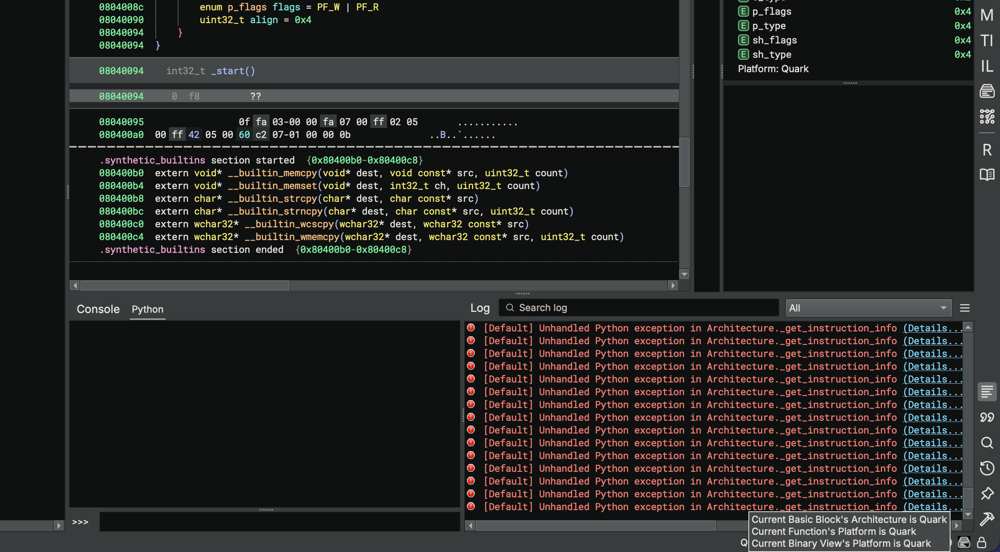
*No decoding yet, but we now have a Quark function created at the entry point.*


It might not look like much yet, but thanks to Binary Ninja's [existing ELF parser](https://github.com/Vector35/binaryninja-api/tree/dev/view/elf), we get to skip a significant amount of work parsing binary files, and we can skip directly to decoding bytes.

## Disassembly

### Decoding

Before we can disassemble the instructions, we need to decode them. In the case of Quark, instructions are always 4 bytes, in a single stream, and there are no segments to differentiate between code and data ([a Von Neumann architecture](https://en.wikipedia.org/wiki/Von_Neumann_architecture)). Binary Ninja will feed instructions to our subclass's implementations of [`get_instruction_info`](https://api.binary.ninja/binaryninja.architecture-module.html#binaryninja.architecture.Architecture.get_instruction_info) and [`get_instruction_text`](https://api.binary.ninja/binaryninja.architecture-module.html#binaryninja.architecture.Architecture.get_instruction_text) to determine instruction size and text. We can make a trivial implementation of both and see instructions start lining up:

```python
    def get_instruction_info(self, data: bytes, addr: int) -> Optional[InstructionInfo]:
        result = InstructionInfo()
        result.length = 4
        return result

    def get_instruction_text(self, data: bytes, addr: int) -> Optional[Tuple[List['function.InstructionTextToken'], int]]:
        tokens = []
        # We will fill out tokens in the next section
        return tokens, 4
```

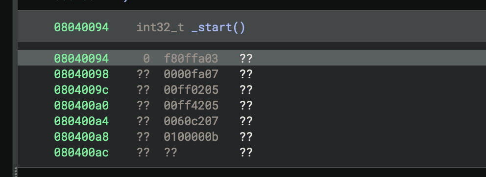
*Our instructions, ready to be decoded*


Quark packs a number of different fields into each 4-byte instruction using bit-shifts and masks to read out opcode, operands, and conditions. We can look at [the interpreter source](https://github.com/Vector35/scc/blob/master/runtime/quark_vm.c) to see precisely how this is done:

```c
uint32_t instr = *(uint32_t*)(r[IP]);
uint32_t cond = instr >> 28;
uint32_t op = (instr >> 22) & 0x3f;
uint32_t a = (instr >> 17) & 31;
uint32_t b = (instr >> 12) & 31;
uint32_t c = (instr >> 5) & 31;
uint32_t d = instr & 31;
// ...
```

We can model this in Python with a bit of structure unpacking and integer math:

```python
class QuarkInstruction:
    def __init__(self, instr: int):
        self.instr = instr

    @property
    def cond(self):
        return self.instr >> 28

    @property
    def op(self):
        return (self.instr >> 22) & 0x3f

    @property
    def a(self):
        return (self.instr >> 17) & 31

    @property
    def b(self):
        return (self.instr >> 12) & 31

    @property
    def c(self):
        return (self.instr >> 5) & 31

    @property
    def d(self):
        return self.instr & 31

    # ... various other properties like larger immediates skipped for brevity
```

Then, as a convenience aid, we can have the disassembly text show us the value of these fields:

```python
class QuarkArch(Architecture):
    # ...

    def get_instruction_text(self, data: bytes, addr: int) -> Optional[Tuple[List['function.InstructionTextToken'], int]]:
        info = QuarkInstruction(int.from_bytes(data, 'little'))

        tokens = []
        tokens.extend([
            InstructionTextToken(InstructionTextTokenType.TextToken, 'cond: '),
            InstructionTextToken(InstructionTextTokenType.TextToken, f'{info.cond}'),
            InstructionTextToken(InstructionTextTokenType.TextToken, ' op: '),
            InstructionTextToken(InstructionTextTokenType.TextToken, f'{info.op}'),
            InstructionTextToken(InstructionTextTokenType.TextToken, ' a: '),
            InstructionTextToken(InstructionTextTokenType.TextToken, f'{info.a}'),
            InstructionTextToken(InstructionTextTokenType.TextToken, ' b: '),
            InstructionTextToken(InstructionTextTokenType.TextToken, f'{info.b}'),
            InstructionTextToken(InstructionTextTokenType.TextToken, ' c: '),
            InstructionTextToken(InstructionTextTokenType.TextToken, f'{info.c}'),
            InstructionTextToken(InstructionTextTokenType.TextToken, ' d: '),
            InstructionTextToken(InstructionTextTokenType.TextToken, f'{info.d}'),
        ])

        return tokens, 4
```

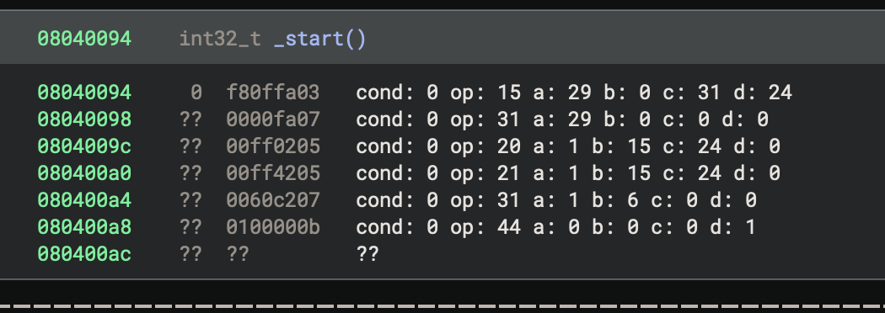
*Disassembling the instructions into their various integer fields*


Printing out the components like this is helpful when determining whether we handled endianness correctly. If it was not right, we would see invalid/undefined opcodes or condition values where we wouldn't expect them. Now that we have the component parts of our instructions decoded, we can proceed to disassembling, where we turn those components into text.

### Disassembly Text

Being a custom VM, Quark doesn't have a specification for how the disassembly text is formatted. Even so, we can use the opcode mnemonics found in the interpreter as a starting point. We can put all of them into an enumeration for easy reference:

```python
class QuarkOpcode(enum.IntEnum):
    ldb = 0x0
    ldh = 0x1
    # ...

    # These are grouped into another enum, based on `b`
    integer_group = 0x1f

    # These are another group, based on `b & 7`
    cmp = 0x2d
    icmp = 0x2e

class QuarkIntegerOpcode(enum.IntEnum):
    mov = 0x0
    xchg = 0x1
    # ...

class QuarkCompareOpcode(enum.IntEnum):
    lt = 0
    le = 1
    # ...
```

Then, we can make the disassembly text show us the opcode mnemonics:

```python
    def get_instruction_text(self, data: bytes, addr: int) -> Optional[Tuple[List['function.InstructionTextToken'], int]]:
        info = QuarkInstruction(int.from_bytes(data, 'little'))
        op = QuarkOpcode(info.op)

        tokens = []

        # Python 3.10 match statements
        match op:
            # Integer ops and compare ops split out into their own groups
            case QuarkOpcode.integer_group:
                int_op = QuarkIntegerOpcode(info.b)
                match int_op:
                    case _:
                        tokens.extend([InstructionTextToken(InstructionTextTokenType.InstructionToken, int_op.name)])
            case QuarkOpcode.cmp | QuarkOpcode.icmp:
                cmp_op = QuarkCompareOpcode(info.b & 7)
                match cmp_op:
                    case _:
                        tokens.extend([InstructionTextToken(InstructionTextTokenType.InstructionToken, cmp_op.name)])
            case _:
                # Just render mnemonic for now
                tokens.extend([InstructionTextToken(InstructionTextTokenType.InstructionToken, op.name)])

        return tokens, 4
```

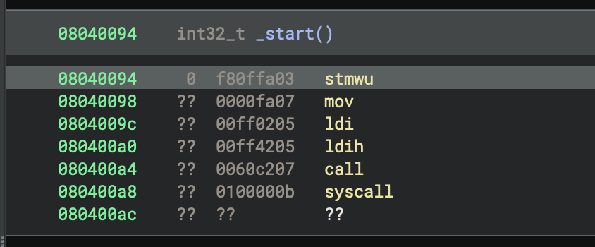
*It's doing something and then doing a syscall*


We can see the previous sample looks reasonable, but is not very long. Let's load a larger binary to be more confident that the opcodes are being decoded correctly. The patterns of the instructions seem sensible, despite not having any operand printing or function boundaries yet:

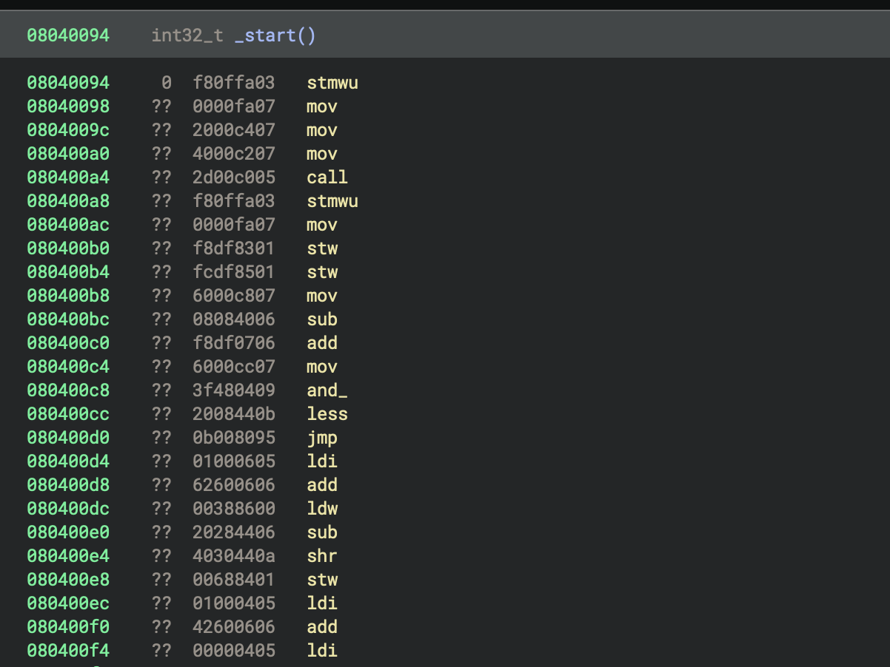
*A bunch of moves followed by a call seems very likely correct*


From this point, the rest of disassembly involves choosing a format for rendering the operands and implementing them one by one. This is largely a straightforward process, as mistakes are pretty easy to spot given the pure text output. Here are a couple notes from the process:

* Calls and jumps in Quark are based on `ip`-relative addresses, calculated after `ip` has incremented, so we need to use `offset + addr + 4` to calculate their destination.
* Operations that refer to the `ip` register need special printing, as the `ip` register is not included in the Architecture's `regs` list. The reasoning behind this special handling of `ip` is addressed later, but for now we can make a helper function for getting register names that handles this special case.
* More complicated addressing modes are consistent across instructions, so we can split them out into a helper function that returns a list of tokens.
* Quark represents constant subtractions as additions with two's complement constants. We chose to resolve this during disassembly and represent additions with values over 0x80000000 as subtractions.
* Using PyCharm and `match` statements, we can tell we are no longer missing any opcodes because the `case _:` statement at the end was marked as unreachable when every enum variant was implemented.

We will use the following pattern for disassembly:

```python
    def get_instruction_text(self, data: bytes, addr: int) -> Optional[Tuple[List['function.InstructionTextToken'], int]]:
        # ...
        tokens = []
        if info.cond & 8:
            if info.cond & 1:
                tokens.extend([
                    InstructionTextToken(InstructionTextTokenType.TextToken, "if"),
                    InstructionTextToken(InstructionTextTokenType.TextToken, " "),
                    InstructionTextToken(InstructionTextTokenType.RegisterToken, f"cc{(info.cond >> 1) & 3}"),
                    InstructionTextToken(InstructionTextTokenType.TextToken, " "),
                ])
            else:
                # ...
        match op:
            case QuarkOpcode.ldb | QuarkOpcode.ldh | QuarkOpcode.ldw | QuarkOpcode.ldbu | QuarkOpcode.ldhu | QuarkOpcode.ldwu | QuarkOpcode.ldsxb | QuarkOpcode.ldsxh | QuarkOpcode.ldsxbu | QuarkOpcode.ldsxhu:
                tokens.extend([
                    InstructionTextToken(InstructionTextTokenType.InstructionToken, op.name),
                    InstructionTextToken(InstructionTextTokenType.TextToken, " "),
                    InstructionTextToken(InstructionTextTokenType.RegisterToken, reg_name(info.a)),
                    InstructionTextToken(InstructionTextTokenType.OperandSeparatorToken, ", "),
                    InstructionTextToken(InstructionTextTokenType.BraceToken, "["),
                    InstructionTextToken(InstructionTextTokenType.RegisterToken, reg_name(info.b)),
                    *cval_tokens(plus=True, zero=False, signed=True),
                    InstructionTextToken(InstructionTextTokenType.BraceToken, "]"),
                ])
            case QuarkOpcode.jmp | QuarkOpcode.call:
                dest = addr + 4 + i32(info.imm22 << 2)
                tokens.extend([
                    InstructionTextToken(InstructionTextTokenType.InstructionToken, op.name),
                    InstructionTextToken(InstructionTextTokenType.TextToken, " "),
                    InstructionTextToken(InstructionTextTokenType.PossibleAddressToken, f"{dest:#x}", value=dest),
                ])
            # ...
            case _:
                tokens.extend([InstructionTextToken(InstructionTextTokenType.InstructionToken, "??")])

        return tokens, 4
```

After implementing disassembly for every opcode, we start to get some nice output:

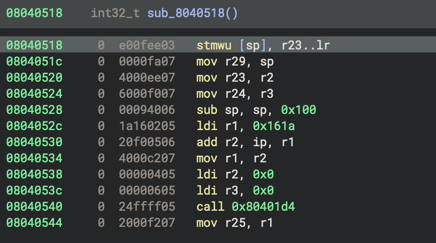
*Looking like a real disassembler now*


In total, implementing the disassembly for Quark took a few hours. The broad range of support provided by Binary Ninja made this process relatively easy to debug, and most of the time was spent trying to construct a disassembly format that looked nice.

### Control Flow

We now have instructions presented nicely, but there is no structure to our disassembly. We need to tell Binary Ninja where the control flow is, so it can split basic blocks and search for functions. This is done by adding details to `get_instruction_info` that report which instructions are branches. While we don't need to know the target of every branch, the more information we can fill in during this stage, the better our basic block analysis will be. There are a couple of things to consider:

* Quark's calls and jumps are `ip`-relative, so we need to calculate those here too, being sure to account for `ip` moving before the address is calculated.
* For conditional jumps, we should make sure to branch to the next instruction for the false case.
* Operations moving into `ip` count as jumps. We could special case `ip = lr` but don't need to.
* System calls don't have real destinations but can be marked as branches anyway.

For the implementation of this, we can use a similar pattern to the disassembly:

```python
    def get_instruction_info(self, data: bytes, addr: int) -> Optional[InstructionInfo]:
        info = QuarkInstruction(int.from_bytes(data, 'little'))
        op = QuarkOpcode(info.op)

        result = InstructionInfo()
        result.length = 4

        match op:
            case QuarkOpcode.jmp:
                if info.cond & 8:
                    if info.cond & 1:  # Jump if condition is met
                        result.add_branch(BranchType.TrueBranch, addr + 4 + i32(info.imm22 << 2))
                        result.add_branch(BranchType.FalseBranch, addr + 4)
                    else:  # Jump if condition is NOT met
                        result.add_branch(BranchType.TrueBranch, addr + 4)
                        result.add_branch(BranchType.FalseBranch, addr + 4 + i32(info.imm22 << 2))
                else:  # Unconditional jump
                    result.add_branch(BranchType.UnconditionalBranch, addr + 4 + i32(info.imm22 << 2))
            case QuarkOpcode.call:  # Call relative
                result.add_branch(BranchType.CallDestination, addr + 4 + i32(info.imm22 << 2))
            case QuarkOpcode.syscall:  # System calls can be annotated, too
                result.add_branch(BranchType.SystemCall)
            case QuarkOpcode.integer_group:
                int_op = QuarkIntegerOpcode(info.b)
                match int_op:
                    case QuarkIntegerOpcode.mov:  # E.g. mov ip, lr
                        if info.a == self.ip_reg_index:  # ip is not a real register in our plugin
                            result.add_branch(BranchType.IndirectBranch)
                    case QuarkIntegerOpcode.call:  # Indirect call
                        result.add_branch(BranchType.CallDestination)
        return result
```

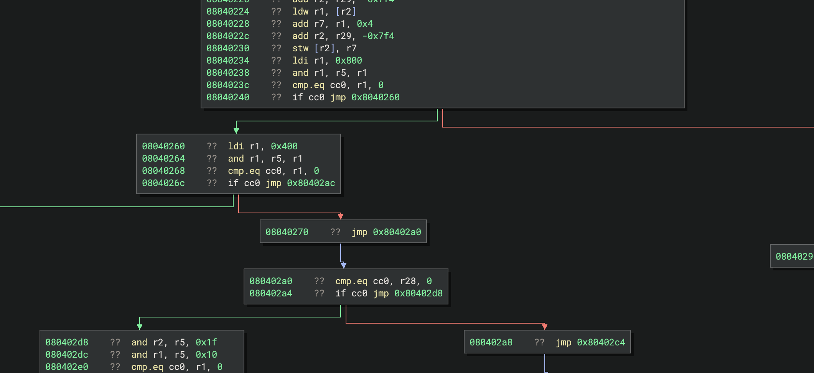
*Now branches split control flow properly*


For a small amount of work, we get large improvements in readability! Instructions are now split into basic blocks, and Graph View lets us pan around the code and see control flow structures. This is likely good enough for implementing a disassembler for most people. That said, there are still a few other optional improvements we can add.

### Addendum

Instructions in Quark are based entirely on details contained within the 4-byte instruction. Other architectures may make use of data contained elsewhere in the binary or have instructions based on state set by previous instructions. Historically, [it wasn't possible to handle those cases](https://github.com/Vector35/binaryninja-api/issues/1407) as Architecture plugins would only get one instruction at a time. However, [recent](https://github.com/Vector35/binaryninja-api/issues/551#issuecomment-3027870588) [additions](https://github.com/Vector35/binaryninja-api/commit/2a4c7d5d89907497e029337bbaf6f7e467bcde98) to the Architecture API let you override `AnalyzeBasicBlocks`, the part of analysis responsible for disassembling an entire function. This allows you to pass context data to `get_instruction_text_with_context` instead of using the context-free `get_instruction_text`. More detail for these new features will be covered in a future post, but for Quark we only need to handle one instruction at a time with no need for context, so we will not be covering that here.

Additionally, Quark instructions' dataflow is all specified within each instruction. Some architectures don't follow this pattern and allow patterns like loops with branches specified by previous instructions that are not observed until later. Delay slots can also be tricky to implement, and historically have been done via lifting each instruction with multiple instructions' worth of data and reordering them if necessary, though [the recent Architecture changes](https://github.com/Vector35/binaryninja-api/issues/551#issuecomment-3027870588) should make this unnecessary as well. Either way, those are also not going to be covered here as Quark's execution flow is rather trivial.

Other topics not covered here, but you may need to support in your architecture:

* Register Stacks: Certain architectures (like x86's x87 FPU) have a "stack" of registers which can have values pushed and popped (but are still backed by a fixed count of registers). These are moderately well-supported by Binary Ninja, but so infrequently used that their documentation is sparse. Look at the [x86 architecture plugin](https://github.com/Vector35/binaryninja-api/tree/dev/arch/x86) as a reference if you need these.
* System Registers: Registers set by the system, they are assumed to be volatile. Reads from them and writes to them will never be dead code eliminated.
* Global Registers: Certain platforms have registers that are referenced by functions but set by the operating system, and they should not be considered as parameters to functions. These can also be defined by a Platform, see [Platform Support](#platform-support) for more information on those.

### Patching

Binary Ninja has built-in support for easy patching of code, which is powered by a few callbacks on Architectures. This patching is great to have when reversing code, as it offers a brute force way to clean up messy functions or remove checks that could prevent you from executing certain branches of the binary.

Here are the available patch operations:

* Convert to NOP: The most commonly used, this replaces the selected sequence of bytes with `nop` instructions.
* Always/Never/Invert Branch: Available on conditional branch instructions, these change the behavior of the branch.
* Skip and Return: Available on call instructions, this lets you replace the call's result with a constant.

Implementing these is simple: First, inform Binary Ninja that you support each patch operation:

```python
    # Convert to NOP does not have a callback. It will be available if the
    # selection does not have the "never branch" patch available.

    def is_never_branch_patch_available(self, data: bytes, addr: int = 0) -> bool:
        # Make sure the data is a conditional branch
        if len(data) != 4:
            return False
        info = QuarkInstruction(int.from_bytes(data, 'little'))
        return info.cond != 0
    def is_always_branch_patch_available(self, data: bytes, addr: int = 0) -> bool:
        # ... same as above
    def is_invert_branch_patch_available(self, data: bytes, addr: int = 0) -> bool:
        # ... same as above

    def is_skip_and_return_zero_patch_available(self, data: bytes, addr: int = 0) -> bool:
        # Make sure the data is a call
        if len(data) != 4:
            return False
        info = QuarkInstruction(int.from_bytes(data, 'little'))
        return info.op == QuarkOpcode.call or (info.op == QuarkOpcode.integer_group and info.b == QuarkIntegerOpcode.call)
    def is_skip_and_return_value_patch_available(self, data: bytes, addr: int = 0) -> bool:
        # ... same as above
```

Then, the callbacks for applying the patches are given the current bytes at the address to patch and should return some bytes to replace them. In support of this, we first add some setters to the various fields on the instruction structure:

```python
class QuarkInstruction:
    # ...

    @cond.setter
    def cond(self, cond):
        self.instr = (self.instr & 0b0000_1111_1111_1111_1111_1111_1111_1111) | ((cond & 0xf) << 28)

    # ...
```

Then, patching instructions just involves mutating the instructions as provided:

```python
    def convert_to_nop(self, data: bytes, addr: int = 0) -> Optional[bytes]:
        # No need to be fancy here, just repeat a sequence that does nothing
        # Could also set QuarkInstruction.cond = 1
        return b'\x00\x00\xc0\x17' * (len(data) // 4)

    # Never branch uses convert_to_nop

    def always_branch(self, data: bytes, addr: int = 0) -> Optional[bytes]:
        if len(data) != 4:
            return None
        info = QuarkInstruction(int.from_bytes(data, 'little'))
        info.cond = 0  # Clear conditional execution flags
        return info.instr.to_bytes(4, "little")

    def invert_branch(self, data: bytes, addr: int = 0) -> Optional[bytes]:
        if len(data) != 4:
            return None
        info = QuarkInstruction(int.from_bytes(data, 'little'))
        info.cond = info.cond ^ 1  # Toggle if the instruction is skipped
        return info.instr.to_bytes(4, "little")

    # Skip and return zero uses skip_and_return_value(0)

    def skip_and_return_value(self, data: bytes, addr: int, value: int) -> Optional[bytes]:
        info = QuarkInstruction(0)
        info.op = QuarkOpcode.ldi
        info.a = 1  # return reg is normally r1
        info.imm17 = value
        return info.instr.to_bytes(4, "little")
```

Adding these is a nice quality-of-life improvement to reversing code with your architecture, but they are not necessary and can be skipped if they are too cumbersome to implement. Here, we've implemented them by modifying the instructions directly, but you can also implement them by assembling new instructions if you have an available assembler.

### Assembling

Integrating a full assembler into your architecture plugin is a nice feature for testing decompilation. Being able to assemble custom instructions lets you hand-construct functions to test obscure instructions that may not be possible to find in compiled binaries. While implementing an assembler is outside the scope of this article, we did write one for Quark, so you can see here how we integrated it.

The first step to adding an assembler is informing Binary Ninja that your architecture has one:

```python
class QuarkArch(Architecture):
    # ...

    # Python's syntax to override a parent class's property
    @Architecture.can_assemble.getter
    def can_assemble(self) -> bool:
        return True
```

Then, the `assemble` method is straight-forward. The only context that Binary Ninja gives your assembler is the text of the assembly and the address of the first instruction. You will need to calculate later instructions' addresses in your assembler and should use these addresses for emitting relative offsets/jumps. Also of note: if the assembled code is shorter than the original code, Binary Ninja will fill the remaining space with `nop` instructions as emitted by the `convert_to_nop` patch function.

With all that considered, the boilerplate for assembling instructions is pretty minimal:

```python
    def assemble(self, code: str, addr: int = 0) -> bytes:
        # Turn `code` into bytes
        try:
            result = ...
        except:
            # Raise a value error if there is a syntax error in the assembly
            raise ValueError("could not assemble: <...>")
        return result
```

Now, Binary Ninja will let us edit lines and create entire blocks of code from assembly text:

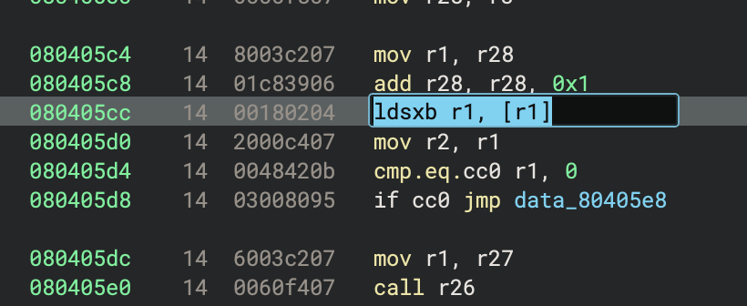
*Pressing E on a line will let you modify the disassembly*

Lifting is the critical step to unlocking Binary Ninja's powerful analysis and decompilation. Often the "left as an exercise to the reader" of Binary Ninja custom architecture tutorials, it is both a lengthy process and one with a lot of subtlety. From simple instructions to flags and intrinsics, the lifting process describes the behavior of every instruction. Let's write a lifter for [Quark](#target)!

## Lifting

To write a lifter, we need to implement `get_instruction_low_level_il`. The lifter needs the same information as the disassembler, so the scaffolding is very similar:

```python
    def get_instruction_low_level_il(self, data: bytes, addr: int, il: LowLevelILFunction) -> Optional[int]:
        info = QuarkInstruction(int.from_bytes(data, 'little'))
        op = QuarkOpcode(info.op)

        match op:
            # Regular ops here
            case QuarkOpcode.integer_group:
                int_op = QuarkIntegerOpcode(info.b)
                match int_op:
                    # Integer ops have their own group
                    case _:
                        il.append(il.unimplemented())
            case QuarkOpcode.cmp:
                cmp_op = QuarkCompareOpcode(info.b & 7)
                match cmp_op:
                    # Comparison ops have their own group
                    case _:
                        il.append(il.unimplemented())
            case QuarkOpcode.icmp:
                cmp_op = QuarkCompareOpcode(info.b & 7)
                match cmp_op:
                    case _:
                        il.append(il.unimplemented())
            case _:
                il.append(il.unimplemented())
        return 4
```

From here, implementing the lifter involves going through every instruction in the disassembly and translating it into IL expressions, trying to keep it simple. Most operations in Quark translate cleanly into Low Level IL, though there are some weird outliers. Below we documented the cases we ran into while writing this, which hopefully covers anything you might run into.

### Basics

It is easier to understand lifters when there are helper functions that reduce the size of the code in each case. Given that, we will write a few helpers for looking up registers based on how the instructions usually operate.

```python
        # Get name of register in `a` component of instruction
        def ra():
            # sanity: make sure we don't lift anything that references ip directly
            assert info.a != self.ip_reg_index, "Can't handle ip"
            return il.arch.get_reg_name(info.a)

        # Get expression to get the register in `a` component of instruction
        def ra_expr():
            # Special case ip register by emitting a constant with its value
            if info.a == self.ip_reg_index:  # ip
                return il.const(4, addr + 4)
            return il.reg(4, il.arch.get_reg_name(info.a))

        # Same exists for `b`, `c`, and `d` components of the instruction
```

We will also implement a helper for `cval`, the Quark equivalent of more complicated constant value and addressing mode encodings found in other architectures.

```python
        def cval():
            if info.largeimm:
                return il.const(4, info.imm11)
            elif info.smallimm:
                return il.const(4, rol(info.imm5, info.d))
            else:
                if info.d == 0:
                    return rc_expr()
                il.append(il.set_reg(4, LLIL_TEMP(0), il.shift_left(4, rc_expr(), il.const(4, info.d))))
                return il.reg(4, LLIL_TEMP(0))
```

Having these helper functions available made the rest of lifting significantly more terse and easy to understand. _The power of being able to fit an entire instruction's IL in one line cannot be understated._

With all of this scaffolding in place, it's time to start implementing instructions. We do this by grouping instructions into similar behaviors and writing lifter code for them, one at a time. Since every instruction is currently lifted as `unimplemented`, we can use the Tags sidebar to see which instructions we have yet to implement. 

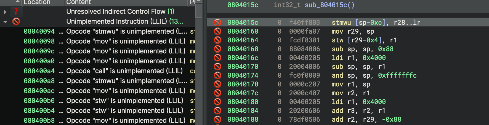
*Tags sidebar showing unimplemented instructions*


### Loads and Stores

Load and store instructions are the main way stack variables are used, and Quark has a decent number of them. Their general format is pretty simple, though you should be careful to insert `zx` and `low_part` instructions to extend and shrink value sizes to match memory/register sizes. There are a couple of details here:

* Check the semantics on loads smaller than the register width, and whether they zero or ignore the upper bits in the existing register
* Quark has "load and update" instructions that increment the source register. We've chosen to lift these using a temporary register, as the VM does the update prior to the load.
* Loads into registers should check for loads to `ip`, as lifting those as with direct register access will not have any effect on control flow. They need to instead be lifted as jumps. To make this guide easier to read, we've left these as calls to `il.set_reg` here. See [the section at the end](#other) for how we handled this in practice.
* Complicated addressing modes may be better to lift with temporary registers. While it's valid to lift complicated statements to deeply nested LLIL expressions, certain optimizations don't traverse deep expression trees and will fail unless you split expressions into sequences of more simple instructions.

Here are a few examples of how we lift these:

```python
            case QuarkOpcode.ldb:  # Load byte
                il.append(il.set_reg(4, ra(), il.zero_extend(4, il.load(1, il.add(4, rb_expr(), cval())))))
            case QuarkOpcode.ldw:  # Load word
                il.append(il.set_reg(4, ra(), il.load(4, il.add(4, rb_expr(), cval()))))
            case QuarkOpcode.ldbu:  # Load byte and update source, inc by 1
                addr = LLIL_TEMP(1)
                il.append(il.set_reg(4, addr, il.add(4, rb_expr(), cval())))
                il.append(il.set_reg(4, rb(), il.add(4, il.reg(4, addr), il.const(4, 1))))
                il.append(il.set_reg(4, ra(), il.zero_extend(4, il.load(1, il.reg(4, addr)))))
            case QuarkOpcode.ldi:  # Load immediate
                il.append(il.set_reg(4, ra(), il.const(4, info.imm17)))
            case QuarkOpcode.ldih:  # Load immediate high
                il.append(il.set_reg(4, ra(), il.or_expr(4, il.zero_extend(4, il.low_part(2, ra_expr())), il.const(4, info.immhi))))
            case QuarkOpcode.stb:  # Store byte
                il.append(il.store(1, il.add(4, rb_expr(), cval()), il.low_part(1, ra_expr())))
            case QuarkOpcode.stw:  # Store word
                il.append(il.store(4, il.add(4, rb_expr(), cval()), ra_expr()))
            case QuarkOpcode.integer_group:
                int_op = QuarkIntegerOpcode(info.b)
                match int_op:
                    case QuarkIntegerOpcode.mov:  # Move into register
                        if info.a == self.ip_reg_index:  # mov to ip is a jump
                            il.append(il.jump(cval()))
                        else:
                            il.append(il.set_reg(4, ra(), cval()))
```

### Calls

Quark uses a Link Register to enable subroutine calls. We informed Binary Ninja about this previously when we set up the Architecture class:

```python
class QuarkArch(Architecture):
    # ...
    link_reg = 'lr'
```

We should not model the `lr` behavior at call sites ourselves. All we need to do is emit the `call` instruction and Binary Ninja will understand that `lr` gets the return address written to it. Some architectures implement call by pushing the return address onto the stack and then jumping to the target. Lifting these looks identical: you do not need to model the stack push behavior. Lifting `call` is then simple. All you need to do is calculate the proper target address:

```python
        match op:
            case QuarkOpcode.call:  # direct call
                il.append(il.call(il.const(4, addr + 4 + (info.imm22 << 2))))
            case QuarkOpcode.integer_group:
                int_op = QuarkIntegerOpcode(info.b)
                match int_op:
                    case QuarkIntegerOpcode.call:  # indirect call
                        addr = LLIL_TEMP(1)
                        il.append(il.set_reg(4, addr, ra_expr()))
                        il.append(il.call(il.reg(4, addr)))
```

For indirect calls, we opted to write the address to a temporary register prior to the call. This is probably unnecessary, but it errs on the side of using more temporary registers so LLIL pattern matching would not need to handle recursive cases. Nothing in the core cares about this case, but if you later write scripts searching LLIL, you won't have to bother making them handle deeply nested trees.

### Arithmetic

Quark's arithmetic instructions are largely basic, fixed size, and single operation, with only two double-precision operations. Of these arithmetic operations, only two instructions use/set flags, which we will handle next. For now, the rest of them fit neatly into LLIL instructions. For double precision operations, be sure to use `set_reg_split` to write the result value and `reg_split` to read the operands.

```python
            case QuarkOpcode.add:
                il.append(il.set_reg(4, ra(), il.add(4, rb_expr(), cval())))
            case QuarkOpcode.sub:
                il.append(il.set_reg(4, ra(), il.sub(4, rb_expr(), cval())))
            case QuarkOpcode.mulx:  # double precision
                il.append(il.set_reg_split(4, rd(), ra(), il.mult_double_prec_unsigned(4, rb_expr(), rc_expr())))
            case QuarkOpcode.imulx:  # double precision
                il.append(il.set_reg_split(4, rd(), ra(), il.mult_double_prec_signed(4, rb_expr(), rc_expr())))
            case QuarkOpcode.div:
                il.append(il.set_reg(4, ra(), il.div_unsigned(4, rb_expr(), cval())))
            case QuarkOpcode.idiv:
                il.append(il.set_reg(4, ra(), il.div_signed(4, rb_expr(), cval())))
            case QuarkOpcode.mod:
                il.append(il.set_reg(4, ra(), il.mod_unsigned(4, rb_expr(), cval())))
            case QuarkOpcode.imod:
                il.append(il.set_reg(4, ra(), il.mod_signed(4, rb_expr(), cval())))
```

Additionally, like many architectures, Quark has instructions for "add with carry" and "subtract with borrow" to enable larger size arithmetic. The only catch is that they require the use of flags for the carry-in/carry-out value, which the next operation in the sequence will have to read. In the lifter, this part is simple:

```python
            case QuarkOpcode.addx:
                il.append(il.set_reg(4, ra(), il.add_carry(4, rb_expr(), cval(), il.flag('cc3'), flags='addx')))
            case QuarkOpcode.subx:
                il.append(il.set_reg(4, ra(), il.sub_borrow(4, rb_expr(), cval(), il.flag('cc3'), flags='addx')))
```

The only new part here is the use of a Flag Write Type, which we will now specify in the Architecture. We chose to call the Flag Write Type `addx` because it is specific to the `addx` family of instructions. Then, we indicate that it sets the `cc3` flag with the `flags_written_by_flag_write_type` property:

```python
class QuarkArch(Architecture):
    # ...
    flags = [
        'cc0', 'cc1', 'cc2', 'cc3',
    ]
    flag_write_types = {
        'addx',
    }
    flags_written_by_flag_write_type = {
        'addx': ['cc3'],
        # ...
    }
```

After doing this, we can see the lifting for these instructions:

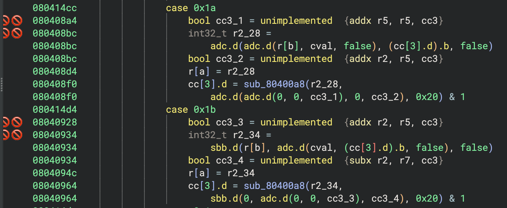
*addx gets lifted as adc but with broken flags*


The `adc.d(...)` instructions are produced, but now they are creating a bunch of `unimplemented` instructions! Looking at the tags created, we can see the reason:

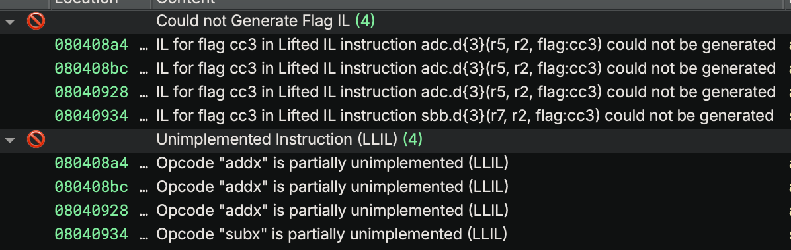
*tags explaining that adc is looking for flags*


Reading the value of flag `cc3` is causing Binary Ninja to attempt to look up its value, but there is nothing to explain how `adc` or `sbb` set the flag in their output. To do that, we need to implement the `get_flag_write_low_level_il` function and tell Binary Ninja what the value of the flag will be when it gets used. This function gets called for uses of flags with unknown definitions, and it produces an IL expression representing the value of the flag. But what is the value of the carry-out flag for `adc` or `sbb`? Let's look at the semantics of those instructions:

* `adc` - Add with Carry: Adds two 32-bit integers and the 1-bit carry flag. Returns a 32-bit integer and a 1-bit carry if the addition overflowed the 32-bit integer maximum. So the expression that represents the value of the carry flag would be, `a + b + carry >= UINT32_MAX`
* `sbb` - Subtract with Borrow: Subtracts two 32-bit integers and 1-bit carry flag (added to the value being subtracted), returns a 32-bit integer and a 1-bit carry if the value being subtracted (plus the carry) was greater than the value from which it was being subtracted. So the expression that represents the value of the carry flag would be, `(b + carry) > a`

Now that we know what the expression of the resulting carry flag is, we can implement `get_flag_write_low_level_il` and tell Binary Ninja what IL to generate for the carry flag. To start, here is the function prototype:

```python
    def get_flag_write_low_level_il(
        self, op: LowLevelILOperation, size: int, write_type: Optional[FlagWriteTypeName], flag: FlagType,
        operands: List['ILRegisterType'], il: 'LowLevelILFunction'
    ) -> 'ExpressionIndex':
        ...
```

First, let's define a few helper functions to convert the operands into IL expressions:

```python
        def get_expr_for_register_or_constant(size, operand):
            if isinstance(operand, ILRegister):
                return il.reg(size, operand)
            elif isinstance(operand, ILFlag):  # Fixed in >= 5.3
                return il.flag(operand.index)
            elif isinstance(operand, int):
                return il.const(size, operand)
            else:
                assert False, "Not handled"

        def get_expr_for_flag_or_constant(operand):
            # For ADC/SBB/RLC/RRC, the carry flag is passed as a temporary "register".
            # This is super specific and only affects those four instructions and one operand,
            # and will be fixed in future versions, but we need to handle it for now:
            if isinstance(operand, ILRegister):
                return il.flag(operand.index)
            elif isinstance(operand, ILFlag):  # Fixed in >= 5.3
                return il.flag(operand.index)
            elif isinstance(operand, int):
                return il.const(size, operand)
            else:
                assert False, "Not handled"
```

And then we can implement the Flag Write Type. Our function gets called with the Flag Write Type's name and the producing operation, which we test for and return the appropriate IL expression:

```python
        match write_type:
            case 'addx':
                if op == LowLevelILOperation.LLIL_ADC:
                    # ((first + second + carry) >> 32) & 1
                    # Which is the same as (first + second + carry) >= 0x1_0000_0000
                    return il.compare_unsigned_greater_equal(
                        8,
                        il.add(
                            8,  # extend the width of these operands so we can test the overflow
                            il.zero_extend(8, get_expr_for_register_or_constant(size, operands[0])),
                            il.add(
                                8,
                                il.zero_extend(8, get_expr_for_register_or_constant(size, operands[1])),
                                il.zero_extend(8, get_expr_for_flag_or_constant(operands[2]))  # !! flag
                            )
                        ),
                        il.const(8, 0x1_0000_0000)
                    )
                if op == LowLevelILOperation.LLIL_SBB:
                    # ((first - (second + carry)) >> 32) & 1
                    # Which is zero unless (second + carry) > first
                    return il.compare_unsigned_greater_than(
                        size,
                        il.add(
                            size,
                            get_expr_for_register_or_constant(size, operands[1]),
                            get_expr_for_flag_or_constant(operands[2])  # !! flag
                        ),
                        get_expr_for_register_or_constant(size, operands[0])
                    )

        return il.unimplemented()
```

And now our large-width arithmetic is lifted properly, although carry-addition is rather difficult to read given Binary Ninja's lack of optimizations for it:

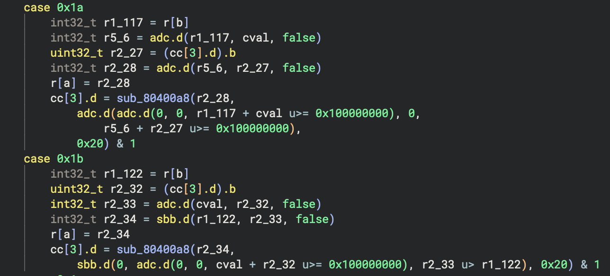
*Addition with carry lifts with expressions for the carry flag*


### System Calls

Lifting system calls is easy. Similar to a call instruction, the LLIL operation for a system call is simply, `il.system_call()`. But how do we specify the system call number? Since many architectures use a register to determine system call number, Binary Ninja makes us pass it in a register.

The Quark architecture embeds the system call number in the syscall instruction itself, so to put that into a register for Binary Ninja, we add an extra synthetic register to the Architecture's `regs` list.

```python
# Previously
class QuarkArch(Architecture):
    regs = {
        # ...
        'syscall_num': RegisterInfo('syscall_num', 4),
    }
```

Then, we can lift the syscall instruction by setting that register and performing a system call:

```python
            case QuarkOpcode.syscall:
                il.append(il.set_reg(4, 'syscall_num', il.const(4, info.imm22)))
                il.append(il.system_call())
```

Seeing this, you may be curious how Binary Ninja can resolve system call names and parameter types. That is explained in the [Calling Convention](#calling-convention) section below.

### Intrinsics

Certain operations don't map cleanly to existing LLIL operations. In those cases, it is often better to lift them as intrinsics: architecture-specific operations that analysis will not try to process. Choosing when to model complex operations as intrinsics is often a matter of taste and effort. We generally recommend these principles:

* Operations that can affect constant propagation are better as non-intrinsic (so constant propagation can run)
* Operations that would need many smaller operations are often better as intrinsics (to reduce clutter)
* SIMD operations are largely not supported by dataflow, so they are better as intrinsics
* Operations that rely on external data or actions (e.g. randomness) need to be intrinsics

In the case of Quark, we've chosen to implement endian byte-swapping as an intrinsic. It is largely irrelevant to constant propagation dataflow, so likely all uses of it will simply clutter our decompilation with precise semantics about an operation that is otherwise easy to understand. To do this, we first need to define the intrinsics in our Architecture subclass:

```python
class QuarkArch(Architecture):
    # ...
    intrinsics = {
        '__byteswaph': IntrinsicInfo(
            # inputs
            [IntrinsicInput(Type.int(2, False), 'input')],
            # outputs
            [Type.int(4, False)]
        ),
        '__byteswapw': IntrinsicInfo(
            [IntrinsicInput(Type.int(4, False), 'input')],
            [Type.int(4, False)]
        ),
    }
```

Each intrinsic needs to specify its list of inputs and outputs. When defining them for the architecture, these are represented with Types, which are likely integers. In this case, `__byteswaph` operates on a 2-byte input but clobbers the entire output register, so its output is a 4-byte integer. `__byteswapw` operates on a 4-byte unsigned integer and returns another 4-byte unsigned integer.

After specifying the intrinsics, lifting them just requires you to specify the list of input expressions and output registers. The one oddity here is that intrinsics are full instructions--they should not be used as a sub-expression of a (for example) `set_reg` instruction. Their outputs need to go into registers, so you may need to create temporary registers if your intrinsics have more complicated semantics. For Quark, this was pretty simple:

```python
                    case QuarkIntegerOpcode.swaph:
                        il.append(il.intrinsic([ra()], '__byteswaph', [il.low_part(2, rc_expr())]))
                    case QuarkIntegerOpcode.swapw:
                        il.append(il.intrinsic([ra()], '__byteswapw', [rc_expr()]))
```

### Flags

Quark, like many other architectures, uses flags to control conditional branches. There are dedicated instructions to set the flags, and different instructions that read them and affect control flow. Because of this, we need to use dataflow for resolving the conditional instructions that use flags.

When it comes to flags and conditional instructions, there are three overall strategies: 

* [Explicit Flag Usage](#explicit-flags)
* Flag Conditions (not covered here, see [Addendum](#addendum))
* [Semantic Flag Groups](#semantic-flag-groups)

While you could have every operation that modifies flags emit IL instructions to set every flag, this is quite tedious since many architectures have arithmetic operations that affect a large number of flags. Trying to lift all of these instructions with explicit flag calculation produces a lot of clutter in the IL, all for flags that are rarely used. Binary Ninja's flag system was designed to minimize this clutter, and we call it Semantic Flags. Using this system, IL is only generated for flags that are used, eliminating a large number of unnecessary flag writes.

Depending on the circumstances, you will want to lift different instructions using the different techniques. We're going to cover explicit flags and semantic flags here.

#### Explicit Flags

Instructions whose explicit purpose is setting flags can be lifted as direct flag writes. The lifting for this is the most obvious approach to flags: get and set their value based on an expression. Here are a few from Quark:

```python
            case QuarkOpcode.integer_group:
                int_op = QuarkIntegerOpcode(info.b)
                match int_op:
                    case QuarkIntegerOpcode.setcc:
                        il.append(il.set_flag(il.arch.get_flag_index(f"cc{info.a & 3}"), il.const(0, 1)))
                    case QuarkIntegerOpcode.clrcc:
                        il.append(il.set_flag(il.arch.get_flag_index(f"cc{info.a & 3}"), il.const(0, 0)))
                    case QuarkIntegerOpcode.notcc:
                        il.append(il.set_flag(il.arch.get_flag_index(f"cc{info.a & 3}"), il.not_expr(0, il.flag(f"cc{info.c & 3}"))))
                    case QuarkIntegerOpcode.movcc:
                        il.append(il.set_flag(il.arch.get_flag_index(f"cc{info.a & 3}"), il.flag(f"cc{info.c & 3}")))
                    case QuarkIntegerOpcode.andcc:
                        il.append(il.set_flag(il.arch.get_flag_index(f"cc{info.a & 3}"), il.and_expr(0, il.flag(f"cc{info.c & 3}"), il.flag(f"cc{info.d & 3}"))))
                    case QuarkIntegerOpcode.orcc:
                        il.append(il.set_flag(il.arch.get_flag_index(f"cc{info.a & 3}"), il.or_expr(0, il.flag(f"cc{info.c & 3}"), il.flag(f"cc{info.d & 3}"))))
                    case QuarkIntegerOpcode.xorcc:
                        il.append(il.set_flag(il.arch.get_flag_index(f"cc{info.a & 3}"), il.xor_expr(0, il.flag(f"cc{info.c & 3}"), il.flag(f"cc{info.d & 3}"))))
```

Since these instructions act specifically on flags, lifting them as explicit flag sets and uses makes sense. 

#### Semantic Flag Groups

The Semantic Flags system in Binary Ninja allows you to specify many advanced behaviors for flags. It does this via a deferred flag resolution system, where flag-setting expressions are only generated when the flags are used. Instead of emitting IL for every flag every time an instruction could modify it, the modifying instructions are tagged with a Flag Write Type that indicates which flags are written. When a flag is used, it gets lifted as testing a Semantic Flag Group, which Binary Ninja can then resolve to the expression setting the flag and then inline that expression. For most common operations, these comparisons can be represented by built-in operations automatically, but there is enough flexibility in the system to support more complex behaviors.

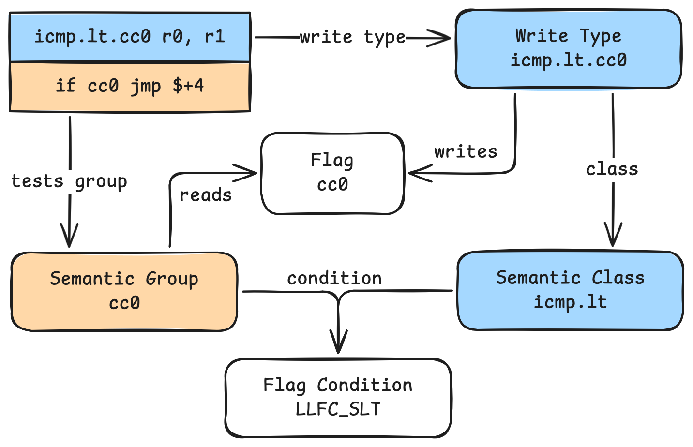
*The Semantic Flags system has a number of components that all relate to each other*


Let's see what we need to specify in our architecture. First, our flags:

```python
class QuarkArch(Architecture):
    # ...
    flags = [
        'cc0', 'cc1', 'cc2', 'cc3',
    ]
```

Certain architectures have flags that follow one of a few predefined behaviors, known as Flag Roles. These include a carry flag, zero flag, overflow flag, etc. If your architecture has those types of flags, you can specify them, and Binary Ninja will automatically resolve many types of comparison expressions. Quark, however, doesn't have dedicated flags for these behaviors, so we mark every flag as `SpecialFlagRole`.

```python
    flag_roles = {
        'cc0': FlagRole.SpecialFlagRole,
        'cc1': FlagRole.SpecialFlagRole,
        'cc2': FlagRole.SpecialFlagRole,
        'cc3': FlagRole.SpecialFlagRole,
    }
```

The instructions that set flags need to specify a Flag Write Type, which informs Binary Ninja both which flags the instruction sets and what type of operation to use for setting the flag. Generally speaking, every different type of operation and flag should get its own Flag Write Type. So for architectures where all arithmetic instructions modify a specific carry/zero/overflow flag in the same way, you would have one Flag Write Type for that behavior. In Quark, as in some architectures like PowerPC, there is not one dedicated flag for carry/zero/overflow/etc, and so we need to create Flag Write Types for every combination of flag and comparison operation. Quark has four flags, eight signed comparison operations, and eight unsigned comparison operations. This leads to a total of 64 Flag Write Types, plus the `addx` type mentioned previously:

```python
    flag_write_types = {
        # Each of the 8 unsigned comparisons that could affect cc0
        'cmp.lt.cc0',  'cmp.le.cc0',  'cmp.ge.cc0',  'cmp.gt.cc0',  'cmp.eq.cc0',  'cmp.ne.cc0',  'cmp.z.cc0',  'cmp.nz.cc0',
        # Same thing for the signed comparisons
        'icmp.lt.cc0', 'icmp.le.cc0', 'icmp.ge.cc0', 'icmp.gt.cc0', 'icmp.eq.cc0', 'icmp.ne.cc0', 'icmp.z.cc0', 'icmp.nz.cc0',
        # Same thing for the other flags
        'cmp.lt.cc1',  'cmp.le.cc1',  'cmp.ge.cc1',  'cmp.gt.cc1',  'cmp.eq.cc1',  'cmp.ne.cc1',  'cmp.z.cc1',  'cmp.nz.cc1',
        'icmp.lt.cc1', 'icmp.le.cc1', 'icmp.ge.cc1', 'icmp.gt.cc1', 'icmp.eq.cc1', 'icmp.ne.cc1', 'icmp.z.cc1', 'icmp.nz.cc1',
        'cmp.lt.cc2',  'cmp.le.cc2',  'cmp.ge.cc2',  'cmp.gt.cc2',  'cmp.eq.cc2',  'cmp.ne.cc2',  'cmp.z.cc2',  'cmp.nz.cc2',
        'icmp.lt.cc2', 'icmp.le.cc2', 'icmp.ge.cc2', 'icmp.gt.cc2', 'icmp.eq.cc2', 'icmp.ne.cc2', 'icmp.z.cc2', 'icmp.nz.cc2',
        'cmp.lt.cc3',  'cmp.le.cc3',  'cmp.ge.cc3',  'cmp.gt.cc3',  'cmp.eq.cc3',  'cmp.ne.cc3',  'cmp.z.cc3',  'cmp.nz.cc3',
        'icmp.lt.cc3', 'icmp.le.cc3', 'icmp.ge.cc3', 'icmp.gt.cc3', 'icmp.eq.cc3', 'icmp.ne.cc3', 'icmp.z.cc3', 'icmp.nz.cc3',
        # And addx, which has its own special behavior
        'addx'
    }
```

Each of the Flag Write Types should specify which flags it writes. This field is how Binary Ninja knows when the flag gets written, as the comparison operations don't set the flags directly. Since Quark's Flag Write Types are split out per flag and per operation, each will only write one flag. If you had a combined carry/zero/overflow Flag Write Type, it would modify multiple flags at once.

```python
    flags_written_by_flag_write_type = {
        # Each of these comparisons only affects one flag at a time
        'cmp.lt.cc0':  ['cc0'], 'cmp.le.cc0':  ['cc0'], 'cmp.ge.cc0':  ['cc0'], 'cmp.gt.cc0':  ['cc0'], 'cmp.eq.cc0':  ['cc0'], 'cmp.ne.cc0':  ['cc0'], 'cmp.z.cc0':  ['cc0'], 'cmp.nz.cc0':  ['cc0'],
        'icmp.lt.cc0': ['cc0'], 'icmp.le.cc0': ['cc0'], 'icmp.ge.cc0': ['cc0'], 'icmp.gt.cc0': ['cc0'], 'icmp.eq.cc0': ['cc0'], 'icmp.ne.cc0': ['cc0'], 'icmp.z.cc0': ['cc0'], 'icmp.nz.cc0': ['cc0'],
        'cmp.lt.cc1':  ['cc1'], 'cmp.le.cc1':  ['cc1'], 'cmp.ge.cc1':  ['cc1'], 'cmp.gt.cc1':  ['cc1'], 'cmp.eq.cc1':  ['cc1'], 'cmp.ne.cc1':  ['cc1'], 'cmp.z.cc1':  ['cc1'], 'cmp.nz.cc1':  ['cc1'],
        'icmp.lt.cc1': ['cc1'], 'icmp.le.cc1': ['cc1'], 'icmp.ge.cc1': ['cc1'], 'icmp.gt.cc1': ['cc1'], 'icmp.eq.cc1': ['cc1'], 'icmp.ne.cc1': ['cc1'], 'icmp.z.cc1': ['cc1'], 'icmp.nz.cc1': ['cc1'],
        'cmp.lt.cc2':  ['cc2'], 'cmp.le.cc2':  ['cc2'], 'cmp.ge.cc2':  ['cc2'], 'cmp.gt.cc2':  ['cc2'], 'cmp.eq.cc2':  ['cc2'], 'cmp.ne.cc2':  ['cc2'], 'cmp.z.cc2':  ['cc2'], 'cmp.nz.cc2':  ['cc2'],
        'icmp.lt.cc2': ['cc2'], 'icmp.le.cc2': ['cc2'], 'icmp.ge.cc2': ['cc2'], 'icmp.gt.cc2': ['cc2'], 'icmp.eq.cc2': ['cc2'], 'icmp.ne.cc2': ['cc2'], 'icmp.z.cc2': ['cc2'], 'icmp.nz.cc2': ['cc2'],
        'cmp.lt.cc3':  ['cc3'], 'cmp.le.cc3':  ['cc3'], 'cmp.ge.cc3':  ['cc3'], 'cmp.gt.cc3':  ['cc3'], 'cmp.eq.cc3':  ['cc3'], 'cmp.ne.cc3':  ['cc3'], 'cmp.z.cc3':  ['cc3'], 'cmp.nz.cc3':  ['cc3'],
        'icmp.lt.cc3': ['cc3'], 'icmp.le.cc3': ['cc3'], 'icmp.ge.cc3': ['cc3'], 'icmp.gt.cc3': ['cc3'], 'icmp.eq.cc3': ['cc3'], 'icmp.ne.cc3': ['cc3'], 'icmp.z.cc3': ['cc3'], 'icmp.nz.cc3': ['cc3'],
        # addx always modifies the cc3 flag
        'addx': ['cc3']
    }
```

From here, you *could* extend the implementation of `get_flag_write_low_level_il` we started above, and handle emitting IL for every one of these flag write types. That does work, but leads to you writing a lot of extra code to handle behaviors that Binary Ninja could automatically resolve for you.

To use Binary Ninja's built-in conditional support, we need to specify a few more constructs. First, we need to list the Semantic Flag Classes for each operation. These classes represent the different types of conditions tested, and each will map to a different IL expression generated. We define one class per unique comparison operation: signed/unsigned less than, less or equal, greater or equal, and greater than; sign-agnostic equality, non-equality, zero, and non-zero. Every Flag Write Type maps to one of these classes, but the classes themselves don't require specific flags.
```python
    semantic_flag_classes = [
        'cmp.lt',  'cmp.le',  'cmp.ge',  'cmp.gt',
        'icmp.lt', 'icmp.le', 'icmp.ge', 'icmp.gt',
        'eq', 'ne', 'z', 'nz',
    ]
    semantic_class_for_flag_write_type = {
        'cmp.lt.cc0':  'cmp.lt',    'cmp.le.cc0':  'cmp.le',    'cmp.ge.cc0':  'cmp.ge',    'cmp.gt.cc0':  'cmp.gt',    'cmp.eq.cc0':  'eq',   'cmp.ne.cc0':  'ne',   'cmp.z.cc0':  'z',   'cmp.nz.cc0':  'nz',
        'icmp.lt.cc0': 'icmp.lt',   'icmp.le.cc0': 'icmp.le',   'icmp.ge.cc0': 'icmp.ge',   'icmp.gt.cc0': 'icmp.gt',   'icmp.eq.cc0': 'eq',   'icmp.ne.cc0': 'ne',   'icmp.z.cc0': 'z',   'icmp.nz.cc0': 'nz',
        'cmp.lt.cc1':  'cmp.lt',    'cmp.le.cc1':  'cmp.le',    'cmp.ge.cc1':  'cmp.ge',    'cmp.gt.cc1':  'cmp.gt',    'cmp.eq.cc1':  'eq',   'cmp.ne.cc1':  'ne',   'cmp.z.cc1':  'z',   'cmp.nz.cc1':  'nz',
        'icmp.lt.cc1': 'icmp.lt',   'icmp.le.cc1': 'icmp.le',   'icmp.ge.cc1': 'icmp.ge',   'icmp.gt.cc1': 'icmp.gt',   'icmp.eq.cc1': 'eq',   'icmp.ne.cc1': 'ne',   'icmp.z.cc1': 'z',   'icmp.nz.cc1': 'nz',
        'cmp.lt.cc2':  'cmp.lt',    'cmp.le.cc2':  'cmp.le',    'cmp.ge.cc2':  'cmp.ge',    'cmp.gt.cc2':  'cmp.gt',    'cmp.eq.cc2':  'eq',   'cmp.ne.cc2':  'ne',   'cmp.z.cc2':  'z',   'cmp.nz.cc2':  'nz',
        'icmp.lt.cc2': 'icmp.lt',   'icmp.le.cc2': 'icmp.le',   'icmp.ge.cc2': 'icmp.ge',   'icmp.gt.cc2': 'icmp.gt',   'icmp.eq.cc2': 'eq',   'icmp.ne.cc2': 'ne',   'icmp.z.cc2': 'z',   'icmp.nz.cc2': 'nz',
        'cmp.lt.cc3':  'cmp.lt',    'cmp.le.cc3':  'cmp.le',    'cmp.ge.cc3':  'cmp.ge',    'cmp.gt.cc3':  'cmp.gt',    'cmp.eq.cc3':  'eq',   'cmp.ne.cc3':  'ne',   'cmp.z.cc3':  'z',   'cmp.nz.cc3':  'nz',
        'icmp.lt.cc3': 'icmp.lt',   'icmp.le.cc3': 'icmp.le',   'icmp.ge.cc3': 'icmp.ge',   'icmp.gt.cc3': 'icmp.gt',   'icmp.eq.cc3': 'eq',   'icmp.ne.cc3': 'ne',   'icmp.z.cc3': 'z',   'icmp.nz.cc3': 'nz',
    }
```

Then, we define Semantic Flag Groups. These are groups of flags that conditional instructions can test together. On certain architectures, conditionals might read multiple flags to determine whether a branch is taken, such branching if both the carry and overflow flag are set. On Quark, however, each branch can only read one flag at a time. This means our Semantic Flag Groups will be one-to-one with the flags. We specify each group and which flags that group tests:
```python
    semantic_flag_groups = [
        'cc0',
        'cc1',
        'cc2',
        'cc3',
    ]
    flags_required_for_semantic_flag_group = {
        'cc0': ['cc0'],
        'cc1': ['cc1'],
        'cc2': ['cc2'],
        'cc3': ['cc3'],
    }
```

#### Automatically Implementing Conditions

Next, we specify which conditions are used for each combination of Semantic Flag Classes and Semantic Flag Groups. When Binary Ninja sees a use of a Semantic Flag Group, it will look up the corresponding Flag Write Type for each flag in the group, and the corresponding Semantic Flag Class for each Flag Write Type. If all of those Semantic Flag Classes are the same, Binary Ninja will look up the Semantic Flag Condition from the architecture and emit the corresponding IL expression for that condition. For Quark, we define a map from each Semantic Flag Group (one-to-one with each flag) and each Semantic Flag Class (one for every type of comparison) to the corresponding condition:

```python
    flag_conditions_for_semantic_flag_group = {
        'cc0': {
            'cmp.lt': LowLevelILFlagCondition.LLFC_ULT,
            'cmp.le': LowLevelILFlagCondition.LLFC_ULE,
            'cmp.ge': LowLevelILFlagCondition.LLFC_UGE,
            'cmp.gt': LowLevelILFlagCondition.LLFC_UGT,
            'icmp.lt': LowLevelILFlagCondition.LLFC_SLT,
            'icmp.le': LowLevelILFlagCondition.LLFC_SLE,
            'icmp.ge': LowLevelILFlagCondition.LLFC_SGE,
            'icmp.gt': LowLevelILFlagCondition.LLFC_SGT,
            'eq': LowLevelILFlagCondition.LLFC_E,
            'ne': LowLevelILFlagCondition.LLFC_NE,
        },
        'cc1': {
            # ... same as cc0
        },
        'cc2': {
            # ... same as cc0
        },
        'cc3': {
            # ... same as cc0
        },
    }
```

This is effectively telling Binary Ninja:
1. When you see a `cc0` Semantic Flag Group test
2. Look at the relevant flag(s)
    1. `cc0` is the only flag that group reads, as defined in `flags_required_for_semantic_flag_group`
3. Figure out which instruction set them
4. If that instruction has a Semantic Flag Class of `icmp.lt`
    1. `icmp.lt` is the Semantic Flag Class corresponding to the `icmp.lt.cc0` Flag Write Type in `semantic_class_for_flag_write_type`
    2. `icmp.lt.cc0` is the Flag Write Type used by a `icmp.lt.cc0` instruction during lifting
5. Use the Flag Condition `LLFC_SLT` to emit an IL expression for that Flag Group test
    1. Specified by the  `flag_conditions_for_semantic_flag_group` map
    2. `LLFC_SLT` emits a `LLIL_CMP_SLT` expression

This will cause Binary Ninja, when resolving flags from Lifted IL to Low Level IL, to replace the instructions `sub.d{icmp.lt.cc0}(expr1, expr2) ; if (cc0)` with the instructions `if (expr1 s< expr2)`, inlining the comparison at the test site.

#### Manually Implementing Conditions

You may notice we did not specify a condition for the `z` and `nz` Semantic Flag Classes. That is because these do not map cleanly to one of the built-in Flag Conditions and need to be lifted manually by us. Since there is no condition in the `flag_conditions_for_semantic_flag_group` mapping, Binary Ninja will call `get_flag_write_low_level_il` for each flag written by the Flag Write Type, to emit an expression that it will write to the flag. It will then call `get_semantic_flag_group_low_level_il` to get an expression that reads the relevant flags, to replace the test. We need to implement those ourselves.

Here are the updates to `get_flag_write_low_level_il` to emit expressions for the `z` and `nz` comparisons. Note that the returned expression is not appended to the IL function to create an IL instruction--the core will insert it into whichever instruction is necessary.

```python
    def get_flag_write_low_level_il(
        self, op: LowLevelILOperation, size: int, write_type: Optional[FlagWriteTypeName], flag: FlagType,
        operands: List['ILRegisterType'], il: 'LowLevelILFunction'
    ) -> 'ExpressionIndex':
        # ...
        match write_type:
            case 'addx':
                ...  # We implemented addx above for add-with-carry

            # `nz` condition: Compare if the AND of two values is non-zero
            case 'cmp.nz.cc0' | 'icmp.nz.cc0' | 'cmp.nz.cc1' | 'icmp.nz.cc1' | 'cmp.nz.cc2' | 'icmp.nz.cc2' | 'cmp.nz.cc3' | 'icmp.nz.cc3':
                return il.compare_not_equal(
                    4,
                    il.and_expr(
                        4,
                        get_expr_for_register_or_constant(4, operands[0]),
                        get_expr_for_register_or_constant(4, operands[1])
                    ),
                    il.const(4, 0)
                )
            # `z` condition: Compare if the AND of two values is zero
            case 'cmp.z.cc0' | 'icmp.z.cc0' | 'cmp.z.cc1' | 'icmp.z.cc1' | 'cmp.z.cc2' | 'icmp.z.cc2' | 'cmp.z.cc3' | 'icmp.z.cc3':
                return il.compare_equal(
                    4,
                    il.and_expr(
                        4,
                        get_expr_for_register_or_constant(4, operands[0]),
                        get_expr_for_register_or_constant(4, operands[1])
                    ),
                    il.const(4, 0)
                )
        return il.unimplemented()
```

Here's how we implement `get_semantic_flag_group_low_level_il` to read the flags tested by our Semantic Flag Groups:

```python
    def get_semantic_flag_group_low_level_il(
        self, sem_group: Optional[SemanticGroupType], il: 'lowlevelil.LowLevelILFunction'
    ) -> 'lowlevelil.ExpressionIndex':
        match sem_group:  # Each Semantic Flag Group only tests one flag since conditional branches can only read one flag
            case 'cc0':
                return il.flag('cc0')
            case 'cc1':
                return il.flag('cc1')
            case 'cc2':
                return il.flag('cc2')
            case 'cc3':
                return il.flag('cc3')
            case _:
                return il.unimplemented()
```

This will cause Binary Ninja, when resolving flags from Lifted IL to Low Level IL, to replace the instructions `and.d{cmp.z.cc0}(expr1, expr2) ; if (cc0)` with the instructions `flag:cc0 = (expr1 & expr2) == 0 ; if (flag:cc0)`. Having to use these callbacks causes Binary Ninja to spill the flag write to a separate instruction.

We also need to specify the IL generated for flag writes for the other comparison operations, in case their results are ever used by instructions that read flags directly (not through a Semantic Flag Group). You can see an example here, in a function that we modified to specifically use this behavior:  

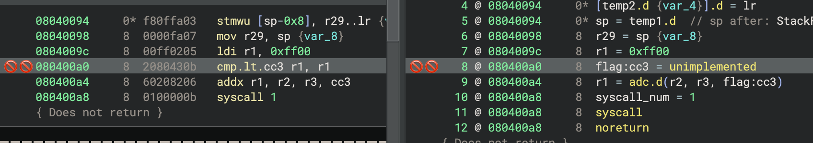
*Deliberately modified function showing how reading flags directly causes the flags to lift as unimplemented*


The solution to this is to modify `get_flag_write_low_level_il` to return valid IL expressions for the Flag Write Types representing the other operations. As before, the returned expression is not appended to the function as an instruction. Here's how we implemented them:

```python
     def get_flag_write_low_level_il(
             self, op: LowLevelILOperation, size: int, write_type: Optional[FlagWriteTypeName], flag: FlagType,
             operands: List['ILRegisterType'], il: 'LowLevelILFunction'
     ) -> 'ExpressionIndex':
         # ...
         match write_type:
             # ...
             case 'cmp.lt.cc0' | 'cmp.lt.cc1' | 'cmp.lt.cc2' | 'cmp.lt.cc3':
                 return il.compare_unsigned_less_than(size, get_expr_for_register_or_constant(size, operands[0]), get_expr_for_register_or_constant(size, operands[1]))
             case 'icmp.lt.cc0' | 'icmp.lt.cc1' | 'icmp.lt.cc2' | 'icmp.lt.cc3':
                 return il.compare_signed_less_than(size, get_expr_for_register_or_constant(size, operands[0]), get_expr_for_register_or_constant(size, operands[1]))
             # ... etc for the rest of the comparisons
```

Having implemented all the Flag Write Types, we now see flags fully resolved when used by expressions:

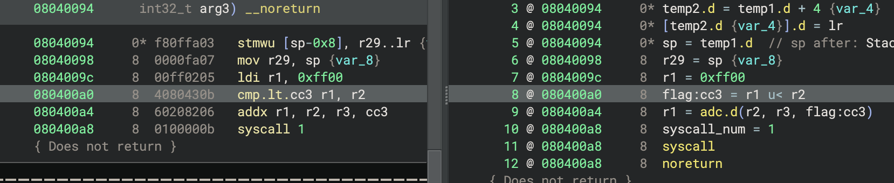
*Flags get resolved after implementing the flag write code*


#### Emitting Comparison Instructions

Now that we've specified how flags are used, we can lift the operations that write flags. You will notice that the comparisons are generally lifted as subtraction operations. This is because [many major architectures](https://www.felixcloutier.com/x86/cmp#operation) [implement comparisons as subtractions](https://developer.arm.com/documentation/ddi0602/2025-12/Base-Instructions/CMP--immediate---Compare--immediate---an-alias-of-SUBS--immediate--). In the case of Quark, subtractions don't set any flags, but we chose to lift most of the comparisons as subtractions to highlight this commonly seen behavior. Due to the custom behavior of the `nz` and `z` comparison operations, we chose to lift these as `and` instructions. This likely has no effect, as the instruction gets replaced by the flags resolver as explained above, but for certain built-in operations, the choice of underlying instruction might affect which comparison is automatically generated.

```python
    def get_instruction_low_level_il(self, data: bytes, addr: int, il: LowLevelILFunction) -> Optional[int]:
        # ...
        match op:
            case QuarkOpcode.cmp:
                cmp_op = QuarkCompareOpcode(info.b & 7)
                match cmp_op:
                    case QuarkCompareOpcode.lt:
                        # Flag Write Type as specified above
                        il.append(il.sub(4, ra_expr(), cval(), flags=f"cmp.lt.cc{info.b >> 3}"))
                    case QuarkCompareOpcode.le:
                        il.append(il.sub(4, ra_expr(), cval(), flags=f"cmp.le.cc{info.b >> 3}"))
                    # ... rest of these

                    case QuarkCompareOpcode.nz:
                        il.append(il.and_expr(4, ra_expr(), cval(), flags=f"cmp.nz.cc{info.b >> 3}"))
                    case QuarkCompareOpcode.z:
                        il.append(il.and_expr(4, ra_expr(), cval(), flags=f"cmp.z.cc{info.b >> 3}"))
                    case _:
                        il.append(il.unimplemented())
            case QuarkOpcode.icmp:
                cmp_op = QuarkCompareOpcode(info.b & 7)
                match cmp_op:
                    case QuarkCompareOpcode.lt:
                        il.append(il.sub(4, ra_expr(), cval(), flags=f"icmp.lt.cc{info.b >> 3}"))
                    # ... same as above except icmp in the flag write type
```

#### Example: aarch64

In an attempt to cover a wider range of use cases for Semantic Flags, here's how this is modeled in aarch64's flags system. You can see the source code for how this was implemented this [in our open-source architecture plugin](https://github.com/Vector35/binaryninja-api/blob/13fccf3aff2cd0de371ac75fd2840c75bf9033f2/arch/arm64/arch_arm64.cpp#L1350). That part of the plugin was [written by yrp](https://github.com/Vector35/arch-arm64/pull/91), whose [numerous](https://github.com/Vector35/arch-arm64/pulls?q=is%3Apr+is%3Aclosed+author%3Ayrp604) [contributions](https://github.com/Vector35/binaryninja-api/pulls?q=is%3Apr+is%3Aclosed+author%3Ayrp604) to the aarch64 architecture plugin have been greatly appreciated.

aarch64 uses the semantic flags system to model a different type of flag behavior. The arithmetic instructions set every flag based on the result of their operation, rather than having dedicated comparison operations (as in Quark). aarch64's conditional instructions read various flags to determine if their condition is true, instead of just reading one flag at a time (also as in Quark). This leads to a significantly different model of flags, but it can still be represented in Semantic Flags. Here's how it works:

* Four flags:
  * `c` the carry flag, with role CarryFlagWithInvertedSubtract
  * `n` the negative sign flag, with role NegativeSignFlag
  * `v` the overflow flag, with role OverflowFlag
  * `z` the zero flag, with role ZeroFlag
* Two Flag Write Types:
  * `*` modifies all flags, used by integer operations
  * `f*` modifies all flags, used by floating point operations
  * Since all arithmetic instructions modify all flags, aarch64 only needs to differentiate between integer and floating point operations, e.g., a `cmp w13, w19` is an integer operation that sets all four flags, so it has the `*` Flag Write Type. 
  * The implementation of `get_flag_write_low_level_il` largely punts to `GetDefaultFlagWriteLowLevelIL` for emitting expressions to set the flags. aarch64 is able to use `GetDefaultFlagWriteLowLevelIL` because its flags can be assigned to built-in Flag Roles, whereas Quark had to implement this function manually. The one exception for aarch64 is that the `c` flag has custom behavior for the `SBB` instruction, similar to how Quark has custom behavior for the `cc3` flag for `addx`/`subx`.
* Two Semantic Flag Classes for the Flag Write Types:
  * `int` class for the `*` Flag Write Type
  * `float` class for the `f*` Flag Write Type
* Semantic Flag Groups for each type of comparison:
  * `eq`, `ne`, `cs`, `cc`, `mi`, `pl`, `vs`, `vc`, `hi`, `ls`, `ge`, `lt`, `gt`, `le`
  * Every conditional instruction uses the specific Semantic Flag Group for that type of comparison, e.g., a `b.lt` instruction uses the `lt` Semantic Flag Group.
  * Each of these groups has a set of required flags based on what flags the operation uses in determining the condition, e.g., the `lt` Semantic Flag Group needs to read the `n` and `v` flags.
  * Instead of the `get_semantic_flag_group_low_level_il` function returning one single flag read, it calls the function `GetFlagConditionLowLevelIL`, which uses the flag roles to emit the appropriate IL expression for the conditional. The actual implementation of `GetFlagConditionLowLevelIL` is currently private in the core's source, but is available [upon request](https://binary.ninja/support/) if you are implementing an architecture and would like to debug your use of flags. We may publish it in the open-source repository at some point in the future.
* Conditions defined for the Semantic Flag Classes and Semantic Flag Groups:
  * `eq` and `int` has condition `LLFC_E` 
  * `eq` and `float` has condition `LLFC_FE` 
  * `lt` and `int` has condition `LLFC_SLT`
  * ... and so on
  * All combinations of Semantic Flag Classes and Semantic Flag Groups are covered here, so there are no custom implementations like Quark's `z` comparison.

And here is the previous Semantic Flags diagram for a signed less-than conditional branch on aarch64:

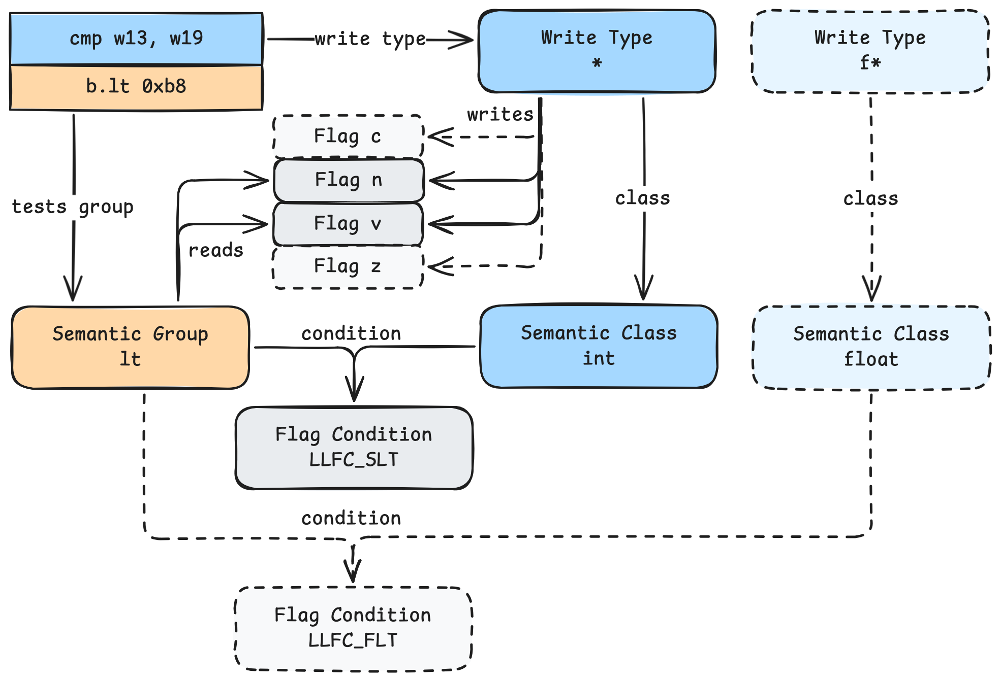
*Semantic Flags diagram for a signed less-than conditional branch on aarch64*


* The `cmp w13, w19` instruction writes flags:
  * It has a Flag Write Type of `*`
  * The aarch64 plugin defines the `*` Flag Write Type as writing all four flags, `c`, `n`, `v`, and `z`.
  * The aarch64 plugin specifies that the `*` Flag Write Type has the Semantic Flag Class of `int` (all integer operations have the same Semantic Flag Class)
* The `b.lt 0xb8` instruction reads flags:
  * It has a Semantic Flag Group of `lt`
  * The aarch64 plugin specifies that the `lt` Semantic Flag Group tests flags `n` and `v`
* The aarch64 plugin specifies that, when the `lt` Semantic Flag Group is testing flags written by the `int` Semantic Flag Class, Binary Ninja should use the `LLFC_SLT` condition to emit the IL expression for that branch.
* Included as an example, but not used in this case: The aarch64 plugin specifies that, when the `lt` Semantic Flag Group is testing flags written by the `float` Semantic Flag Class, Binary Ninja should use the `LLFC_FLT` condition to emit the IL expression for that branch.

There are a lot of moving parts to the Semantic Flags system, and specifying them all correctly can be tricky. We hope that this clears up how you can use it for implementing your own architecture plugins. If you have any questions or need support on this, please feel free to [contact us](https://binary.ninja/support/).

### Conditionals

Quark instructions can all be conditionally executed, depending on flags set when the instruction executes. Luckily for us, these conditions only apply to one instruction at a time (unlike thumb2's `itt` blocks), so we've chosen to model this with simple if-expressions that skip the instruction if the condition is false. The tricky part about conditional branches is getting the IL labels correct. We need two labels, one to target if the instruction gets executed, and one to target if not. For the expression to test, since we handled flags above using Semantic Flags, we only need to use a `flag_group` expression. For Quark, we know that each of these groups only tests one flag. If your architecture has conditional branches that depend on multiple flags, you will still only need the one `flag_group`, as you should have defined those groups as requiring multiple flags as described above.

```python
    def get_instruction_low_level_il(self, data: bytes, addr: int, il: LowLevelILFunction) -> Optional[int]:
        # ...

        after = None
        if info.cond & 8:
            # Conditionally executed
            before = LowLevelILLabel()
            after = LowLevelILLabel()
            if info.cond & 1:  # Execute instruction if condition is true
                il.append(
                    il.if_expr(
                        il.flag_group(f"cc{(info.cond >> 1) & 3}"),
                        before,
                        after
                    )
                )
            else:  # Execute instruction if condition is false
                il.append(
                    il.if_expr(
                        il.not_expr(0, il.flag_group(f"cc{(info.cond >> 1) & 3}")),
                        before,
                        after
                    )
                )
            # Label right before the real instruction, jumping here will execute it normally
            il.mark_label(before)

        match op:
            # ... emit instruction

        if after is not None:
            # Label after the instruction, jumping here will skip execution
            il.mark_label(after)
```

If your architecture has the concept of conditional jumps instead of conditionally executed instructions, you can emit the same `if_expr` in the lifting for those conditional jumps, and use `il.get_label_for_address` to get the IL label objects for the jump targets. Pass that function the address of the next instruction, or the destination, and it will give you the label at the start of the corresponding block. [See the 6502 lifter in the NES example plugin](https://github.com/Vector35/binaryninja-api/blob/15a836af4ae798a1d030394e872781ca381cf844/python/examples/nes.py#L402).

If your architecture has the concept of conditionally executed blocks of instructions, you will need a fancier lifter that can piece apart the blocks in a way that represents how the control flow actually works. That will likely require overriding `analyze_basic_blocks` and having a custom implementation for block splitting, which is beyond the scope of this guide. [Look at the `thumb2` architecture's handling of `itt` instructions as a reference.](https://github.com/Vector35/binaryninja-api/blob/dev/arch/armv7/thumb2_disasm/arch_thumb2.cpp#L1660)

### Other

There are a few other loose ends we still need to clean up. Notably, the fact that instructions can write directly to the `ip` register, which Binary Ninja does not recognize as a jump. For these cases, we split the register setting instructions into a helper function, which checks for setting the `ip` register, and emits a jump instead:

```python
        # Same signature as set_reg so we can easily replace the existing code
        def set_reg_or_jmp(size, reg, value):
            if reg == self.ip_reg_index:
                return il.jump(value)
            else:
                return il.set_reg(size, reg, value)
```

Then, we need to replace every instruction that uses `set_reg` with `set_reg_or_jmp`:

```python
        match op:
            case QuarkOpcode.ldb:
                il.append(set_reg_or_jmp(4, info.a, il.zero_extend(4, il.load(1, il.add(4, rb_expr(), cval())))))
            case QuarkOpcode.ldh:
                il.append(set_reg_or_jmp(4, info.a, il.zero_extend(4, il.load(2, il.add(4, rb_expr(), cval())))))
            case QuarkOpcode.ldw:
                il.append(set_reg_or_jmp(4, info.a, il.load(4, il.add(4, rb_expr(), cval()))))
            # ...
            case QuarkOpcode.mulx: 
                # The set_reg_split call could have either half output into ip,
                # so output to temporary registers and then set those 
                il.append(il.set_reg_split(4, LLIL_TEMP(1), LLIL_TEMP(2), il.mult_double_prec_unsigned(4, rb_expr(), rc_expr())))
                # We need to modify ra first in case ra == rd, but if ra == rd == ip
                # then modifying ra first would cause the jump to happen and skip modifying rd.
                # Since ra == rd clobbers ra anyway, we can skip that write and solve this while
                # keeping the semantics of the instruction correct.
                if info.a != info.d:
                  il.append(set_reg_or_jmp(4, info.a, il.reg(4, LLIL_TEMP(2))))
                il.append(set_reg_or_jmp(4, info.d, il.reg(4, LLIL_TEMP(1))))
            case QuarkOpcode.imulx:
                il.append(il.set_reg_split(4, LLIL_TEMP(1), LLIL_TEMP(2), il.mult_double_prec_signed(4, rb_expr(), rc_expr())))
                if info.a != info.d:
                  il.append(set_reg_or_jmp(4, info.a, il.reg(4, LLIL_TEMP(2))))
                il.append(set_reg_or_jmp(4, info.d, il.reg(4, LLIL_TEMP(1))))
```

By using helper functions, we were largely able to keep all operations able to be lifted on one line, but opted to leave this modification for last, as it adds clutter in the pursuit of completeness.

#### Addendum

The Quark architecture aligns pretty well with Binary Ninja's lifting system. Each instruction can be lifted independently of both the other instructions and the binary itself. For other architectures and file formats, this may not be the case. Instead of being able to lift one instruction at a time, you may need to lift the entire function in one go, constructing the IL instructions and control flow based on relationships between the instructions and the data in the file. For those cases, you will want to implement the new API `Architecture.lift_function`. A more thorough explanation of how to do this is beyond the scope of this guide. Until then, if you find yourself needing this, you can [reference our open sourced `DefaultLiftFunction` implementation in the API repository](https://github.com/Vector35/binaryninja-api/blob/3eda43f185a0411538745a99e251122e6a9192e0/defaultarch.cpp#L719). The short explanation is, you will have to go through all the basic blocks in the function and emit IL instructions manually for all of them. There is a bunch of miscellaneous bookkeeping structures that need to be constructed as well, so be sure to reference that default implementation for guidance. 

Other topics not covered here:

* Floating Point: Quark doesn't support floating point instructions, so there wasn't a reasonable example to give here. Largely, floating point operations are similar to integer operations, with various additional conversion operators whose behavior should be documented in the API docs. 
* Register Stacks (again): Certain architectures (like x86's x87 FPU) have a "stack" of registers which can have values pushed and popped, but are still backed by a fixed set of registers. These are moderately well-supported by Binary Ninja but so infrequently used that their documentation is sparse. Look at the [x86 architecture plugin](https://github.com/Vector35/binaryninja-api/tree/dev/arch/x86) as a reference if you need these.
* Flag Conditions (the system): The older system for flags resolution in Binary Ninja, the Flag Conditions System is separate from Semantic Flags and only supports a subset of the behaviors you can model. We opted to not cover it here as a result. The x86 architecture plugin makes use of this system, though, so if you are curious about it and want to try it yourself, [you can reference that implementation here](https://github.com/Vector35/binaryninja-api/blob/3eda43f185a0411538745a99e251122e6a9192e0/arch/x86/il.cpp#L423).

Adding platform support to an architecture plugin is one of the best ways to improve decompilation. While disassembling and lifting give us good results, they are limited in scope and cannot fill in details about the operating system. With platform support, we can add rich annotations to the analysis and get better results. Let's look through the many systems Binary Ninja includes for implementing platform support in a plugin of your own.

## Platform Support

Up until now, we've implemented all the functionality with a custom architecture, but we haven't gotten to more specific details like calling conventions, system calls, and library signatures yet. For those, we need to implement a Platform subclass. Binary Ninja distinguishes between the concept of an architecture and a platform to allow for details to be defined at generic and specific places. Architectures describe processor behavior, like instructions, and platforms describe operating system behavior, like register selection and types. To make further platform-specific improvements to our decompilation results, we need to implement a platform.

You can register a Platform with the Binary View Type in a very similar manner to registering an Architecture. In the case of Quark on Linux, this is pretty straightforward:

```python
class LinuxQuarkPlatform(Platform):
    name = "linux-quark"

qlinuxplatform = LinuxQuarkPlatform(qarch)
qlinuxplatform.register("linux")

# Linux uses ELF platforms 0 and 3, so register for both
BinaryViewType['ELF'].register_platform(0, qarch, qlinuxplatform)
BinaryViewType['ELF'].register_platform(3, qarch, qlinuxplatform)
```

Specifying the platform won't have any visible changes immediately, but by implementing the next few sections we can improve decompilation significantly.

### Calling Convention

The first thing to notice when looking at the decompilation results is that the control flow looks good, but the arguments to every function call are wrong. This is because, to get proper function call arguments detected, you need to specify them via a Calling Convention. These are relatively straightforward to declare-- you just need to fill out a few fields:

```python
class QuarkCallingConvention(CallingConvention):
    name = "qcall"
    caller_saved_regs = ['r1', 'r2', 'r3', 'r4', 'r5', 'r6', 'r7', 'r8', 'r9', 'r10', 'r11', 'r12', 'r13', 'r14', 'r15']
    callee_saved_regs = ['r16', 'r17', 'r18', 'r19', 'r20', 'r21', 'r22', 'r23', 'r24', 'r25', 'r26', 'r27', 'r28']
    int_arg_regs = ['r1', 'r2', 'r3', 'r4', 'r5', 'r6', 'r7', 'r8']
    int_return_reg = 'r1'
    high_int_return_reg = 'r2'
    arg_regs_for_varargs = False
```

* `caller_saved_regs` - Registers that the caller assumes can be modified by the callee, so the caller must save them itself
* `callee_saved_regs` - Registers that the caller assumes are not modified by the callee, so the callee needs to save them if it modifies them
* `int_arg_regs` - Arguments passed to integer parameters at call sites, in order. Arguments passed after this are assumed to be on the stack
* `int_return_reg` - Register that return value is passed in
* `high_int_return_arg` - For double-width size return values, the high bits are passed in this register
* `arg_regs_for_varargs` - Some compilers have variadic functions put all the variable arguments on the stack, instead of using the remaining register slots. If that is the case (and it is with SCC/Quark), then set this to False.

Other fields that Quark did not need, but you can specify:

* `float_arg_regs` - If your architecture supports separate floating-point registers used for arguments, you can specify those as well
* `float_return_reg` - If your architecture has a separate floating-point register used for return values, you can specify that
* `arg_regs_share_index` - When passing mixed integer and floating point arguments to functions, some platforms use shared slot indices and some use split indices. With shared slot indices, each argument uses either the integer or floating point register for its index, and the other is reserved but unused. For a function with the signature `void foo(int, int, float, int, float)`, this leads to an argument list of `void foo(int @ i0, int @ i1, float @ f2, int @ i3, float @ i4)` where `f0`, `f1`, `i2`, and `f3` registers are unused. In contrast, split slot indices cause each integer and floating point argument to pull the next free register from their list, regardless of how many arguments of the other type are present. In these cases, the order of integer and floating point arguments does not affect one another, and each use registers from their set in order. This leads to argument lists like `void foo(int @ i0, int @ i1, float @ f0, int @ i2, float @ f1)` where, despite the arguments being interleaved, they don't skip any registers in either set. This divergence in behavior can cause issues with recognizing parameters at call-sites, so if you see strange behavior for functions with mixed integer and floating point arguments, you may need to set this to True.
* `stack_reserved_for_arg_regs` - Certain platforms reserve stack space for arguments even when they are passed as registers. Set this to True when this is the case.
* `stack_adjusted_on_return` - Some platforms have the caller allocate stack space for arguments, then the callee frees the stack space itself (x86's stdcall is one such example)
* `eligible_for_heuristics` - Binary Ninja will try to guess the calling convention at untyped call sites, but certain calling conventions should not be considered, such as syscall conventions. Those conventions should set this to False.
* `global_pointer_reg` - Certain calling conventions use a register as a "global pointer" with a value loaded early on in execution and remaining constant throughout the lifetime of the program. If this is specified, Binary Ninja will attempt to discover the value of this global pointer, and any use of that register will infer its value from what analysis discovered.
* `implicitly_defined_regs` - Certain calling conventions pass registers to calls which are not included in type signatures (such as how MIPS on Linux sets `$t9` to the address of the called function, but this should not clutter up the type signature).
* `required_arg_regs` - If specified, heuristic calling convention detection will only consider this calling convention if all the registers specified here are used before they are defined.
* `required_clobbered_regs` - If specified, heuristic calling convention detection will only consider this calling convention if the function clobbers all the registers specified here.

Then, we need to register the Calling Convention and tell the Platform and Architecture to use it:

```python
# ... qarch = Architecture['Quark']
# ... qlinuxplatform = LinuxQuarkPlatform(qarch)

qcc = QuarkCallingConvention(qarch, "qcall")

qarch.register_calling_convention(qcc)
qarch.default_calling_convention = qcc

qlinuxplatform.register_calling_convention(qcc)
qlinuxplatform.default_calling_convention = qcc
```

After implementing the Calling Convention, decompilation for function calls looks significantly better. Function calls that previously had no parameters are now resolved, and many functions that were erroneously marked as `__pure` and eliminated are now called as expected:

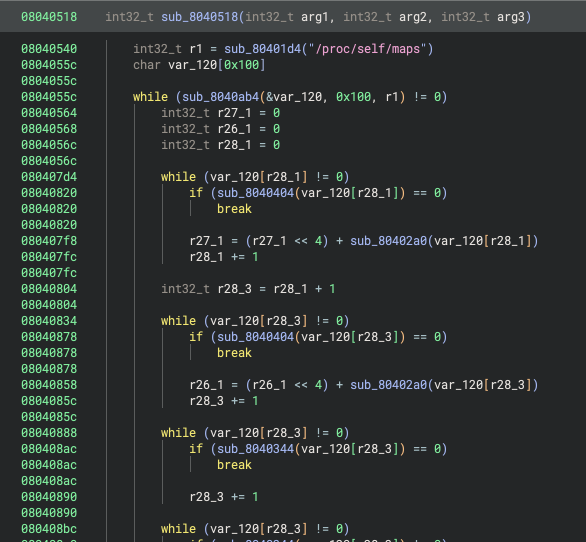
*Function calls have proper arguments now*


### System Calls

System call names and types need to be defined by a Platform. They are specific to the operating system, since multiple operating systems could use the same architecture but have different meanings for the different system call numbers. As a result, system call details are defined by the Platform object.

Since the system call number must be specified in a register, this likely means you need to have a unique calling convention for system calls. The system call number register is always passed as the first argument to a system call, and this must be reflected in the calling convention definition. In the case of Quark, system call instructions include the syscall number, which is saved to a synthetic register we named `syscall_num`. Other notable changes here are that system calls won't clobber any registers other than return registers and that the calling convention should be marked False for `eligible_for_heuristics` so that unresolved calls won't have a chance to be assumed to be system calls.

```python
class QuarkSyscallCallingConvention(CallingConvention):
    name = "qsyscall"
    caller_saved_regs = ['r1', 'r2']
    callee_saved_regs = ['r3', 'r4', 'r5', 'r6', 'r7', 'r8', 'r9', 'r10', 'r11', 'r12', 'r13', 'r14', 'r15', 'r16', 'r17', 'r18', 'r19', 'r20', 'r21', 'r22', 'r23', 'r24', 'r25', 'r26', 'r27', 'r28']
    int_arg_regs = ['syscall_num', 'r1', 'r2', 'r3', 'r4', 'r5', 'r6', 'r7', 'r8']
    int_return_reg = 'r1'
    high_int_return_reg = 'r2'
    eligible_for_heuristics = False
```

The system call calling convention is registered with the Platform and will be used for all system calls:

```python
# ... qlinuxplatform = LinuxQuarkPlatform(qarch)

qlinuxplatform.register_calling_convention(qsyscall)
qlinuxplatform.system_call_convention = qsyscall
```

After defining a system call calling convention, we can now see syscall numbers and arguments being passed to syscalls, but they don't have names yet. We will handle that in the sections on [Platform Types](#platform-types) and [Type Libraries](#type-libraries). But for now, at least we can see which ones are being used:

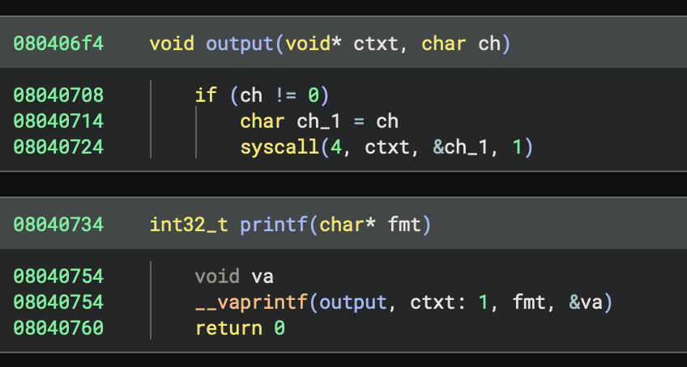
*Now we can see it's doing syscall number 4*


### Platform Types

Platform Types are types included by all binaries using the platform. These are often used for common library functions and system calls. While it can be tempting to put an entire standard library's worth of types into Platform Types, you should try to keep them relatively short and only include what you expect to be used by all binaries. For the rest, consider using [Type Libraries](#type-libraries), whose types are only included in analyses if they are actually used. Usually, Platform Types only include what is necessary for the `noreturn` functions/system calls on the platform, and everything else goes in a Type Library.

Here is all we need to specify for Quark's Platform Types:

```c
// linux-quark.c

// C variadic args type is usually in platform types
typedef void* va_list;

// Syscalls for process termination are included
void sys_exit(int32_t status) __syscall(1) __noreturn;
void sys_exit_group(int32_t status) __syscall(252) __noreturn;

// Often, platforms have standard library exit functions.
// Quark doesn't have these, but here is how you could specify them
// void exit(uint32_t status) __noreturn;
// void _terminate(uint32_t status) __noreturn;
// void terminate(uint32_t status) __noreturn;
```

Then, we need to tell the Platform where our Platform Types source file is located. We'll put this in a subdirectory of the plugin:

```python
class LinuxQuarkPlatform(Platform):
    # ...

    # Platform types are in this file
    type_file_path = str(Path(__file__).parent / "types" / "linux-quark.c")
```

Now we can see that the exit system call gets resolved and annotated with its name and parameters. Other system calls are still unresolved; we will address those in the section on [Type Libraries](#type-libraries).

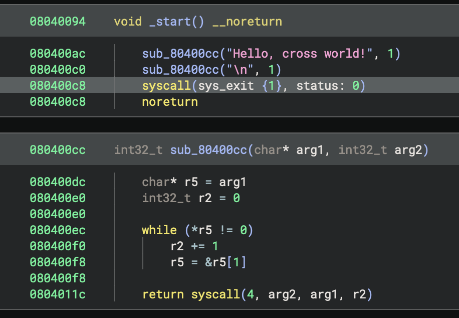
*sys_exit now gets its name and type*


Note: While not recommended, you _can_ put the rest of the system call types and/or OS-defined standard library types into this file, and that _will_ get you good results where they get resolved as expected. The problem with this is that they will clutter up every analysis's System Types list and may cause conflicts between versions if you need to update them in the future. Binary Ninja's first-party plugins generally choose to use Type Libraries instead for this reason. Thus, for this guide, we're going to follow our recommended design and only put the `noreturn` library functions and system calls into the Platform Types. The rest will be defined by Type Libraries.

### Type Libraries

Type Libraries are where Platforms store the bulk of standard library and system call types. They have the benefit of only importing types to your analyses when they are used, so you aren't cluttering up your System Types. Usually, Type Libraries represent an individual, dynamically linkable shared library in your platform, such as `libc` or `libpthread`. There is also a special case Type Library used for system calls, which we will be covering as well.

#### Standard Library

Quark's standard library is defined by a bunch of C headers, which we can parse using Binary Ninja's type parser APIs to create Type Libraries. Generally speaking, it is recommended to create Type Libraries in an automated manner, since they are not possible to modify after-the-fact. This ends up being straightforward: we just need to specify a list of headers and what arguments to pass to the type parser, then we can parse the headers and add the parsed types to a new Type Library.

First, we specify the headers we are going to parse with the arguments they need:

```python
HEADERS = [
    {
        "files": [
            "/Users/user/Documents/binaryninja/scc/runtime/posix/file.h",
            # ...
        ],
        "args": [
            # scc's headers need to know where the system headers live
            "-I/Users/user/Documents/binaryninja/scc",
            # scc's headers need va_list defined, so pull that from vararg.h
            "-include/Users/user/Documents/binaryninja/scc/runtime/vararg.h"
        ]
    },
    # ... more copies of this with slightly different args for different files.
]
```

Then, we construct a new Type Library for our Platform:

```python
p = Platform["linux-quark"]

tl = TypeLibrary.new(p.arch, "stdlib")
tl.add_platform(p)  # critical: mark the Type Library as supporting this Platform
```

Then, we parse all the headers:

```python
for group in HEADERS:
    for file in group["files"]:
        with open(file, "r") as f:
            source = f.read()
        parse, errors = TypeParser.default.parse_types_from_source(
            source,
            file,
            p,
            tl.type_container,
            group["args"]
        )
        if parse is None:
            print(f"Errors in {file}: {errors}")
        else:
            parse: TypeParserResult
            # ...
```

Then, we take the parsed types from the file and add them to our Type Library:

```python
            for ty in parse.types:
                tl.add_named_type(ty.name, ty.type)

            # Add functions second, so they can reference the types we just added
            for func in parse.functions:
                tl.add_named_object(func.name, func.type)
```

Finally, we write the Type Library to a file:

```python
    tl.write_to_file(str(Path(__file__).parent / f"{tl.name}.bntl"))
```

After [registering the Type Library](#registration), any time an executable dynamically links against the shared library with the same name as our Type Library, Binary Ninja will automatically include the Type Library in the analysis and import types from it as needed.

#### Alternate Names

Some operating systems are tricky, and their linker will resolve multiple different names to the same dynamic library. Since they all reference the same library, their types and definitions should all be the same. Instead of requiring you to make multiple identical copies of these libraries, Binary Ninja's Type Library system allows you to specify alternate names for a Type Library. While Quark does not need to do this (it has no dynamic linker), Windows uses this extensively. Using the Type Library Explorer, which you can enable via the `ui.experimental.typelibExplorer` setting, we can observe this:

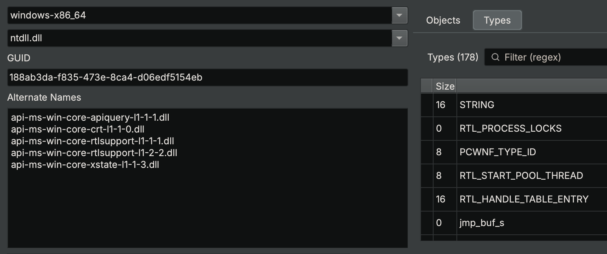
*Windows's `ntdll.dll` Type Library will be loaded if an executable links against `api-ms-win-core-crt-l1-1-0.dll`, among other names*


There is an API to add alternative names to your Type Libraries. You must use it when creating the Type Library:

```python
# ... tl = TypeLibrary.new(...)
tl.add_alternate_name("api-ms-win-core-crt-l1-1-0.dll")
```

#### System Calls

Binary Ninja will automatically load the `SYSCALLS` Type Library for every binary that uses system calls. We can generate one of those ourselves, then system calls will be resolved using their number. This will allow Binary Ninja to annotate them with their name and type. Using the same mechanism as for the standard library, put all the structure and enumeration types used by the system calls into a C source file. Then, add the system call definitions to the file as functions with the `__syscall(N)` attribute applied, specifying their system call numbers. Finally, use the script from above to create a Type Library named `SYSCALLS` from that source file. Your source should look something like this:

```c
// Types used by the syscalls

typedef uint64_t dev_t;
typedef uint32_t __ino_t;
typedef uint32_t mode_t;
typedef uint32_t __nlink_t;
// ...
struct stat
{
    dev_t st_dev;
    int32_t st_pad1[0x3];
    __ino_t st_ino;
    mode_t st_mode;
    __nlink_t st_nlink;
    // ...
};

// System call definitions as functions
// ...
int32_t sys_stat(char const* pathname, struct stat* statbuf) __syscall(106);
int32_t sys_lstat(char const* pathname, struct stat* statbuf) __syscall(107);
int32_t sys_fstat(int32_t fd, struct stat* statbuf) __syscall(108);
// ...
```

Be sure to call the Type Library generated for system calls, `SYSCALLS`, so it will get loaded automatically once we [register it](#registration).

##### Copying Existing Syscalls

Because Quark inherits the system calls from the platform executing its VM, we can create a Type Library with the contents of the `SYSCALLS` library from `linux_x86`. If you're implementing the Linux platform and your architecture is identical to x86, you might be able to do the same. This is pretty easy with the API:

```python
from pathlib import Path
from binaryninja import Platform, TypeLibrary, Architecture

tl = TypeLibrary.new(Architecture["Quark"], "SYSCALLS")
tl.add_platform(Platform["linux-quark"])

# linux_x86's SYSCALLS Type Library
xtl = Platform["linux-x86"].get_type_libraries_by_name("SYSCALLS")[0]

# Copy types and functions
for name, ty in xtl.named_types.items():
    tl.add_named_type(name, ty)
for name, ty in xtl.named_objects.items():
    tl.add_named_object(name, ty)

tl.write_to_file(str(Path(__file__).parent / f"syscalls_linux_x86.bntl"))
```

This will work if you know that all of your Linux syscall structures are exactly the same on your architecture as on x86, which is usually not the case. It may be helpful to instead print the syscall details to a source file and correct it by hand:

```python
from binaryninja import TypeLibrary, Architecture

# linux_x86's SYSCALLS Type Library
xtl = Platform["linux-x86"].get_type_libraries_by_name("SYSCALLS")[0]
# Print types and functions
for name, ty in xtl.named_types.items():
    for line in ty.get_lines(xtl.type_container, name):
        for token in line.tokens:
            print(token.text, end="")
        print()
for name, ty in xtl.named_objects.items():
    for line in ty.get_lines(xtl.type_container, name):
        for token in line.tokens:
            print(token.text, end="")
        print()
```

Even if your system call structures are different, this can be a fast way to get started writing a system calls Type Library source file.

#### Registration

After creating our Type Libraries, before they can be loaded, we need to register them with Binary Ninja. This can either be done by having you (and all of your plugin's users) copy the Type Libraries into `$BN_USER_DIRECTORY/typelib/Quark`, or you can do it from your plugin's script with a few lines:

```python
# Load all Type Libraries in plugin's typelib subdirectory
for file in (Path(__file__).parent / "typelib").glob("*.bntl"):
    tl = TypeLibrary.load_from_file(str(file))
    if hasattr(tl, 'register'):  # >= 5.3 need to register separately
        tl.register()
```

After all of this, we can now get names and types for the rest of the system calls:

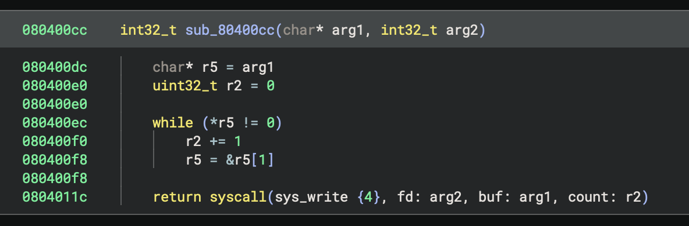
*System calls now have their names and types annotated*


#### Statically Linked Standard Library

You may ask: What if your standard library is fully statically linked and your targets never dynamically link any libraries? You could use WARP to match all the statically linked functions and assign them types ([see below](#standard-library-signatures)), but if any fail to match, you likely will want to have a Type Library so you can set their type yourself. You would have to import that Type Library into your analysis and pull types manually. Instead, you can add it to every binary automatically by using the Platform's `view_init` callback. That is relatively easy to do:

```python
class LinuxQuarkPlatform(Platform):
    # ...

    def view_init(self, view: BinaryView):
        # Note: in Binary Ninja 5.2 and prior, this callback had a bug
        # You can use this as a shim
        if not isinstance(view, BinaryView):
            view = BinaryView(handle=binaryninja.core.BNNewViewReference(view))

        # Add the Type Library
        view.add_type_library(TypeLibrary.from_name(self.arch, "stdlib"))
```

And that's it! Now every binary will have the standard library's types available:

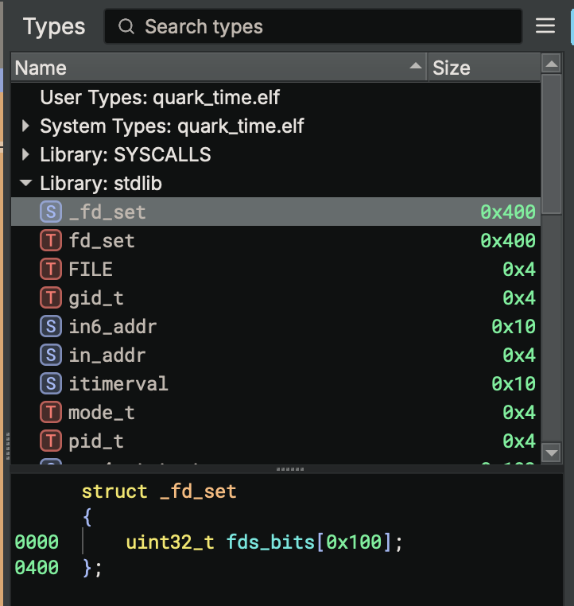
*The standard library's Type Library is available, and we can use its types*


If your platform supports dynamic linking, you should not need to do this. Simply name the Type Libraries the same name as for what the dynamic linker would search for each library, and Binary Ninja should load the relevant ones automatically. Also, this is not necessary for the `SYSCALLS` Type Library, which will get loaded automatically.

#### Ordinals

Some libraries have the dynamic linker resolve their functions not by name but by ordinal. These ordinals are unique numbers, assigned to the functions when the library was linked, which need to be included for our Type Library to resolve them.

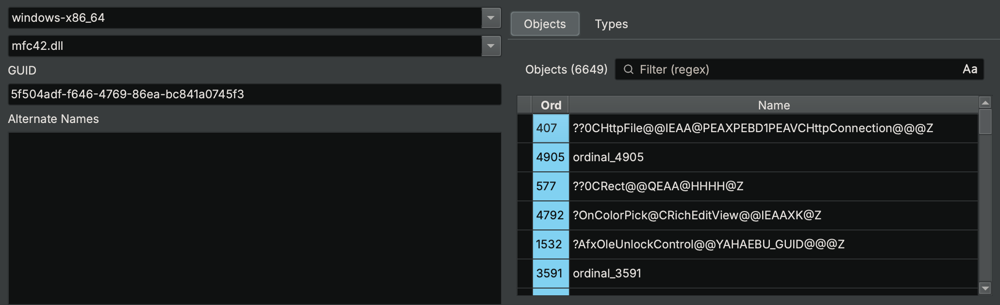
*Windows's mfc42.dll references all of its imported functions by ordinals, which can be seen in the Type Library Explorer*


The process for mapping these ordinals to names is not well-specified, and neither is their API. Since these are highly platform-specific, the ordinal data is stored in a Metadata key on the Type Library, which is later read by the Binary View when it is loading binaries. This is only implemented on PE binaries in first-party plugins, but if you write a custom Binary View implementation, you can do the same.

Here's how PEView does it. First, when resolving library imports, it loads the ordinals from the appropriate Type Libraries:

```c++
bool PEView::Init()
{
    // ...

    // Find type libraries using name of an imported library
    vector<Ref<TypeLibrary>> typeLibs = platform->GetTypeLibrariesByName(libName);
    for (const auto& typeLib : typeLibs)
    {
        if (GetTypeLibrary(typeLib->GetName())) // Don't load libraries twice
            continue;
        AddTypeLibrary(typeLib);
    }

    // Read ordinals from the libraries
    Ref<Metadata> ordinals;
    for (const auto& typeLib : typeLibs) // Account for there possibly being zero libraries
        ordinals = typeLib->QueryMetadata("ordinals");
    if (ordinals && !ordinals->IsKeyValueStore()) // Sanity check in case the library's ordinals is not a dictionary
        ordinals = nullptr;
```

Then, when resolving imported functions from that library, it consults the ordinals table (if it exists) to find the name of the function:

```c++
    // ...

    if (isOrdinal)
    {
        // Look up ordinal in ordinals dictionary
        Ref<Metadata> ordInfo = nullptr;
        if (ordinals)
            ordInfo = ordinals->Get(to_string(ordinal));
        // ... use ordInfo->GetString() to get function name
    }
```

Given this behavior, we can see that the ordinals in the Type Library are a dictionary, mapping ordinal number to function name, stored in the "ordinals" metadata key of the Type Library. We can query this from Python:

```python
tl = Platform["windows-x86_64"].get_type_libraries_by_name("mfc42.dll")[0]
tl.query_metadata("ordinals")
# [('1000', '??1CPropertyPageEx@@UEAA@XZ'), ('1001', '??1CPropertySection@@QEAA@XZ'), ('1002', '??1CPropertySet@@QEAA@XZ'), ('1003', '??1CPropertySheet@@UEAA@XZ'), ('1004', '??1CPropertySheetEx@@UEAA@XZ'), ('1005', '??1CPtrArray@@UEAA@XZ'), ('1006', '??1CPtrList@@UEAA@XZ'), ('1007', '??1CPushRoutingFrame@@QEAA@XZ'), ('1008', '??1CPushRoutingView@@QEAA@XZ'), ('1009', '??1CReBar@@UEAA@XZ'), ...]
```

We can make our own Type Libraries include ordinal information by setting that key in their metadata when creating them:

```python
# ...
# tl = TypeLibrary.new(...)
ordinals = {"0": "something", "1": "another thing", ...}
tl.store_metadata("ordinals", ordinals)
```

Note that, for the case of Quark, since we have not implemented a custom Binary View Type for loading our files, this will not do anything. We would need to either implement our own Binary View Type for a file format that uses ordinals or add support for Quark in PE files (which is possible but not covered here).

### Function Signatures

For many embedded systems, there is no dynamic linker: all used library functions get bundled into every executable that uses them. They clutter up analysis and make you spend extra time identifying common functions. A lot of this extra work can be avoided by creating function signatures, which can automatically identify these statically linked functions and annotate them during initial analysis with their names and types.

In Binary Ninja, you can generate these signatures using WARP. You do this by marking up an analysis that contains the functions you want to match, and then have WARP generate a signature file from your analysis. In the case of Quark, we chose to create a source file that used every function in the standard library, so we could annotate them all at once.

[Our source file](https://github.com/Vector35/arch_quark/blob/main/signatures/quark_stdlib.c) looked something like this:

```c
void file_group()
{
    puts("chdir");
    chdir("/");
    puts("close");
    close(0);
    struct stat buf;
    puts("fstat");
    fstat(0, &buf);
    char stuff[0x10];
    puts("read");
    read(0, stuff, 0x10);
    // ... every other file function
}
void main()
{
    file_group();
    // ... every other group of functions
}
```

After compiling, we are left with a binary that contains an implementation of every standard library function, each called immediately after a `puts()` call that contains its name, for easy locating. We then analyze that binary and annotate each of these functions with their name. Since they're named, we can then use `Import Header File` to import the standard library's headers and easily apply type signatures to every function we annotated.

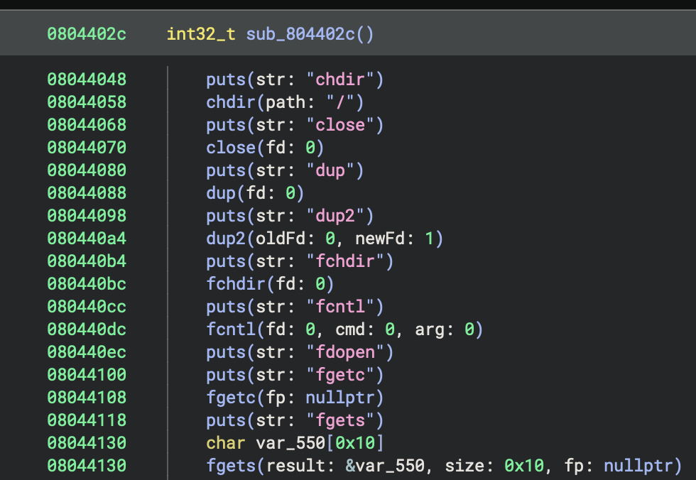
*Analyzed standard library calls with names and types*


With this analysis, we then mark all the standard library functions to be exported using the `WARP - Include Function` action. Next, we use the `WARP - Create from Current View` action to save a file containing signatures for the functions we marked. Now that we have signatures, we have to tell WARP to automatically include them when using the plugin, which is relatively easy. We do this by adding to our `view_init` from earlier:

```python
class LinuxQuarkPlatform(Platform):
    # ...
    def view_init(self, view: BinaryView):
        # ...
        WarpContainer['User'].add_source(str(Path(__file__).parent / "signatures" / "quark_stdlib.warp"))
```

Now, any future binaries we load will have their statically linked standard library functions annotated automatically:

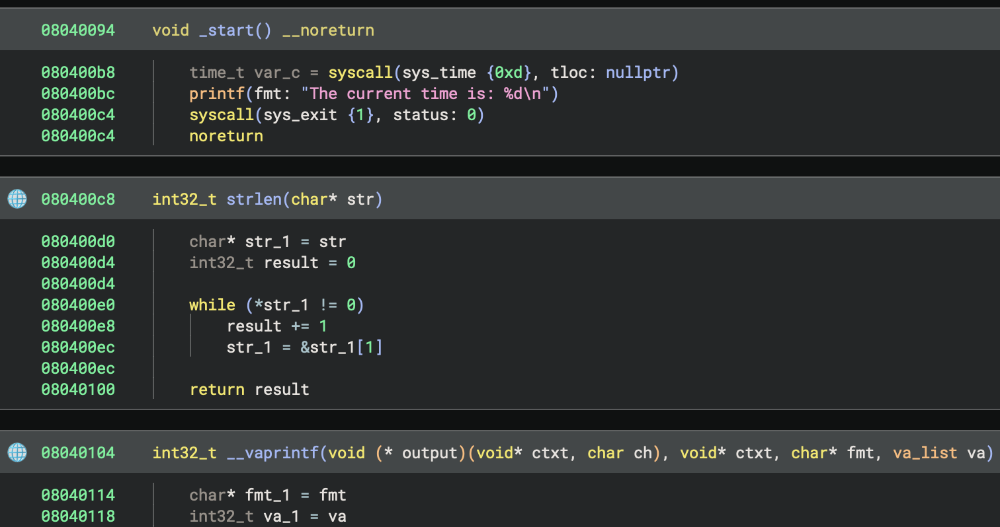
*Statically linked standard library functions now have their names and types annotated for us*


#### Inlined Functions

One of the problems we ran into when generating signatures is that SCC really likes to inline function calls. While we can't do anything about this in the general case, we need to prevent it from happening in the analysis we're using to generate signatures. That's because it prevents those functions from being emitted separately in a form we can annotate. We can work around the compiler: since SCC only inlines functions when their caller is short, we can add a bunch of cruft to the end of the harness functions so SCC will not inline their callees:

```c
#define dont_inline_me_bro() \
    puts(""); puts(""); puts(""); puts(""); puts(""); puts(""); \
    puts(""); puts(""); puts(""); puts(""); puts(""); puts(""); \
    puts(""); puts(""); puts(""); puts(""); puts(""); puts(""); \
    puts(""); puts(""); puts(""); puts(""); puts(""); puts(""); \
    puts(""); puts(""); puts("");

void file_group()
{
    // ...
    puts("write");
    write(0, stuff, 0x10);

    dont_inline_me_bro();
}
```

After this, none of the standard library functions are inlined in the analysis we are using to create signatures, and we can annotate them all. This won't apply to other binaries, where the inliner could have run, but at least we have full coverage of the standard library in case the functions aren't inlined.

#### IP-Relative Offsets

Another issue we ran into during signature generation is that standard library functions make use of ip-relative loads for referencing calls and variables. WARP is designed to ignore all relocatable ("variant") instructions, as their contents will change depending on compilation order. In Quark, this works for call instructions but falls apart for referencing data variables. This is because call instructions include the relative offset in their bytecode, but relative loads use multiple instructions. Because of this, the ip-relative constant cannot be distinguished from a regular register load. We can see this by enabling the WARP Render Layer and inspecting which instructions get highlighted as variant. Notice how `0x0804290c` is not marked, despite containing the ip-relative constant `0x52ad` that gets added to `ip` in the following instruction:

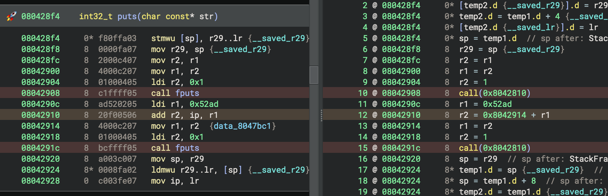
*0x52ad is an ip-relative offset, and we need WARP to exclude it from signature generation*


This causes other binaries using `puts()` to not match its signature, since they have a different constant loaded into `r1` that does not match the one in the signatures:

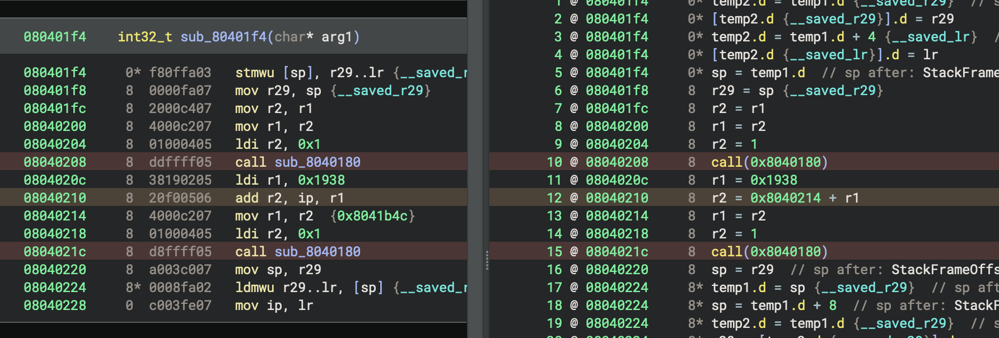
*This version of puts() uses a different constant and doesn't get matched.*


Due to the complex problem of "what is this constant used for," we can't simply have WARP exclude all constant loads, or even just loads which are used on arithmetic with `ip`. However, we can constrain this specific case well enough to actually make a difference, due to a few convenient factors that may not generalize for other platforms:

1. The constant is always loaded in the instruction directly before it is used
2. The following instructions always clobber the register into which the constant was loaded
3. The lifting of `ip` can be detected and so the whole pattern is possible to search for

Given that, we set out to replace the LLIL generated by these instructions with an equivalent statement that WARP can detect as variant and exclude from signatures. Specifically, we want to replace the sequence, `r1 = <const> ; r2 = <ip> + r1 ; r1 = r2` with the sequence, `r1 = <const + ip> ; r2 = <const + ip>`, which has identical semantics but ensures both `r1` and `r2` are set with an ip-relative value that WARP can detect.

There are two ways to do this:

1. In the Architecture, extend `max_instr_length` to three times the instruction length. When lifting, search three instructions at a time and look for that sequence. If found, lift them all as the replacement sequence and make sure that `get_instruction_info` reports the instruction is three times the normal width. Otherwise, lift as normal and only report instructions as being the normal size. This requires adding special cases to the lifter, causing it to have inconsistent behavior when lifting a function versus one instruction at a time. It's also a huge hack, which we would rather avoid (especially in a tutorial). Even so, this sort of technique has been used for other architectures to implement delay slots and conditional blocks.
2. Use a Workflow to detect the instruction sequence early during lifting and replace it before later analyses run. This requires writing and registering a custom Workflow, which can do these more powerful operations but adds complexity.

Given these options, we'll write a Workflow. First, we set up the scaffolding for a Workflow with an Activity that is only active for Quark binaries:

```python
def rewrite_lil_relative_load(context: AnalysisContext):
    # ...

qwf = Workflow("core.function.metaAnalysis").clone("core.function.metaAnalysis")
qwf.register_activity(Activity(
    configuration=json.dumps({
        "name": "arch.quark.rewrite_relative_load",
        "title": "Quark: Combine Relative Load Instructions",
        "description": "Combine the instructions for relative loads into one instruction, for improvements in signature generation",
        "eligibility": {
            "predicates": [
                # Only for linux-quark platform
                # Theoretically we want "only for quark arch" but arch predicates don't exist
                {
                    "type": "platform",
                    "operator": "==",
                    "value": "linux-quark",
                }
            ]
        }
    }),
    action=lambda context: rewrite_lil_relative_load(context)
))

qwf.insert_after("core.function.generateLiftedIL", [
    "arch.quark.rewrite_relative_load"
])
qwf.register()
```

Some key insights from this:

* The Activity is registered after `generateLiftedIL` so it applies to Lifted IL at the earliest point in analysis. We chose to put it at this level because it doesn't need any of the dataflow from higher levels.
* There is an eligibility predicate to check for the Platform being `linux-quark`. Currently, there is no way to specify predicates for Architectures in general, but checking via Platform is good enough for us for now, since we're only registering one Platform anyway.
* We chose to modify the default `metaAnalysis` Workflow with an eligibility predicate instead of making a new Workflow, because we want our behavior to be enabled by default, but don't want to modify the BinaryView (ELF view) to select a new Workflow for us.

With the Workflow registration out of the way, we can add the scaffolding for the transformation:

```python
def rewrite_lil_relative_load(context: AnalysisContext):
    # Copy the Lifted IL to a new function with transformations
    any_replaced = False
    old_llil = context.lifted_il
    new_llil = LowLevelILFunction(old_llil.arch, source_func=old_llil.source_function)
    new_llil.prepare_to_copy_function(old_llil)
    for old_block in old_llil.basic_blocks:
        new_llil.prepare_to_copy_block(old_block)
        # !! Make an iterator of the old instructions, which we can advance to skip them
        # since our pattern replaces multiple instructions
        instructions = iter(range(old_block.start, old_block.end))
        for old_instr_index in instructions:
            old_instr: LowLevelILInstruction = old_llil[InstructionIndex(old_instr_index)]
            new_llil.set_current_address(old_instr.address, old_block.arch)

            # Replace instructions here
            # match ...:
            #     case ...:
            #         ...
            #         continue

            # Otherwise, copy instructions unchanged
            new_llil.append(old_instr.copy_to(new_llil))

    # Update analysis if we changed anything
    if any_replaced:
        new_llil.finalize()
        context.lifted_il = new_llil
```

This scaffolding is a generic [Copy Transformation](https://docs.binary.ninja/dev/bnil-modifying.html#adding-instructions-and-replacing-multiple-instructions-copy-transformation) on Lifted IL, which iterates all blocks and instructions in the function, and, if a condition is met, modifies them. The only difference from the boilerplate used in the documentation is that we're explicitly creating an iterator object for the old function's instructions, so we can advance it to skip multiple instructions in one go.

The pattern we're matching here is a rather specific sequence of instructions-- so specific that we can actually use Python's `match` statement and some conditionals:

```python
            # Make sure we have 3 instructions to load
            if old_instr_index + 2 < old_block.end:
                # Load the next two instructions so we have a sequence of 3 instructions
                old_next_instr: LowLevelILInstruction = old_llil[InstructionIndex(old_instr_index + 1)]
                old_next_instr_2: LowLevelILInstruction = old_llil[InstructionIndex(old_instr_index + 2)]
                # Match all 3 instructions at once
                match (old_instr, old_next_instr, old_next_instr_2):
                    case (
                        # rA = const
                        # rB = <addr> + rA
                        # rA = rB
                        LowLevelILSetReg(dest=regA, src=LowLevelILConst(constant=const)),
                        LowLevelILSetReg(
                            dest=regB,
                            src=LowLevelILAdd(
                                left=LowLevelILConst(constant=const_2),
                                right=LowLevelILReg(src=regA_2)
                            )
                        ),
                        LowLevelILSetReg(dest=regA_3, src=LowLevelILReg(src=regB_2))
                    ) if const_2 == old_next_instr_2.address and regA == regA_2 == regA_3 and regB == regB_2:
                        # Emit replacement instructions ...
```

We match a tuple of the next three instructions against the corresponding Python classes for our pattern. The match statement lets us bind variables to the operands of those instructions, which we can then unify with a conditional, still in the match arm. Since our pattern requires that multiple instructions use the same register, we can name the bound variables `regA`, `regA_2`, and `regA_3`, and compare their equality in the condition.

Then, emitting the replacement instructions is simply a matter of constructing them. We can calculate the value of the constant ahead of time, and lift it as a `const` expression. We need to make sure to set both registers to the right value, to not change the behavior of the original instructions. We also need to be sure to transfer the source locations of the previous instructions to our new instructions so IL-to-disassembly mappings line up. We need to use the address of the ip-relative constant load instruction, which was the first instruction, so WARP can identify that address as variant and exclude it. Finally, we lift an extra `nop` instruction at the end, so all three source instructions' addresses are used. That step is not critical, but without it, that instruction has no mapping in LLIL, and it causes oddities with stack resolution.

```python
                    case ...:
                        # rA = <addr + const>
                        new_llil.append(
                            new_llil.set_reg(
                                old_instr.size,
                                regA,
                                new_llil.const(
                                    old_instr.size,
                                    const + const_2,
                                    loc=old_next_instr_2.source_location
                                ),
                                loc=old_instr.source_location
                            )
                        )
                        # rB = <addr + const>
                        new_llil.append(
                            new_llil.set_reg(
                                old_instr.size,
                                regB,
                                new_llil.const(
                                    old_instr.size,
                                    const + const_2,
                                    loc=old_next_instr_2.source_location
                                ),
                                loc=old_next_instr.source_location
                            )
                        )
                        # Adding a nop here fixes stack resolution on the third instruction in disassembly view
                        # Not sure why that happens, but this prevents it
                        new_llil.append(new_llil.nop(loc=old_next_instr_2.source_location))
                        # Skip the next two instructions in the IL function
                        # because we matched them above and are replacing them here
                        next(instructions)
                        next(instructions)
                        any_replaced = True
                        continue
```

All of this comes together to rewrite the IL for this common pattern into a form that WARP can detect as variant. From the WARP Render Layer, we can see that the instruction loading the ip-relative constant in the disassembly is now marked properly.

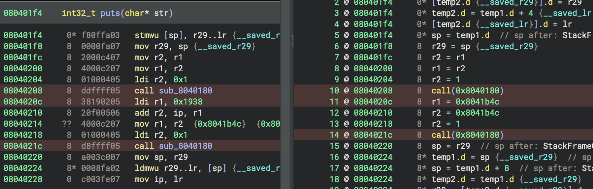
*The ip-relative constant load is marked as variant now*


The second instruction, which actually does the addition, is not highlighted as variant despite its IL also making use of an ip-relative constant. If you query WARP in the Python console, it seems to be properly considered as variant, so this might be due to a bug in the WARP Render Layer right now. That shouldn't matter, though, since its opcode bytes don't include any relative offsets.

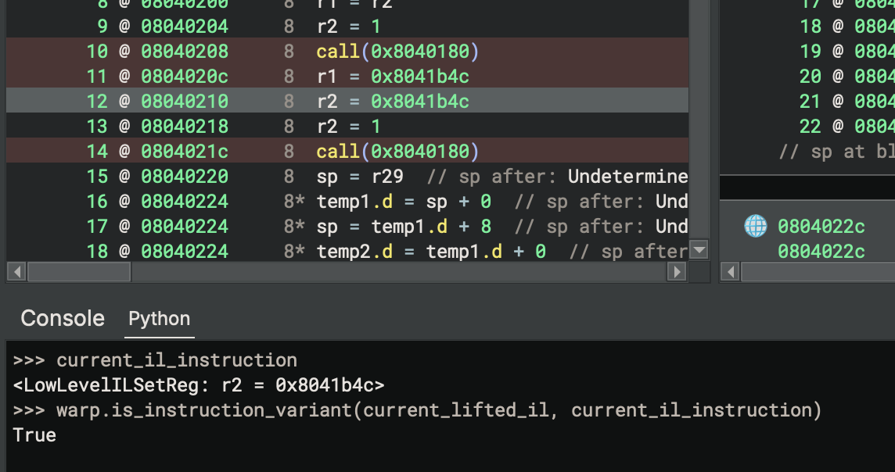
*The other instruction is also variant, even if the Render Layer doesn't notice*


Regenerating the signatures again after this change, we can now see that `puts()` is being matched on other binaries:

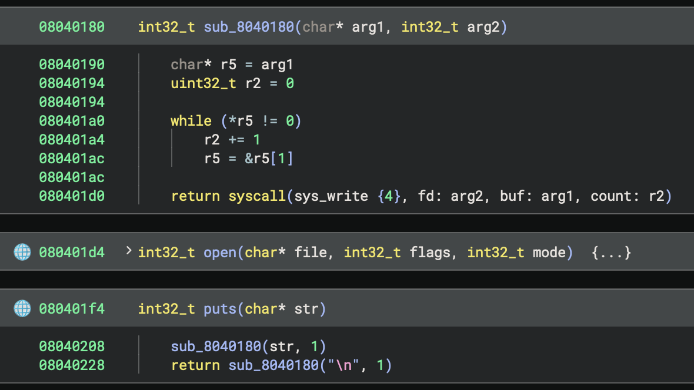
*`puts` gets matched now*


In this case, `puts` got matched properly, where it wasn't before. You may notice that the call to `fputs` from within `puts` did not get matched, which is because its call to `strlen` was inlined. That will happen in any place a call gets inlined, and is not easy to resolve currently. Solving that would be a significantly more challenging problem, requiring us to either generate signatures for all possible combinations of inlining or be capable of [un-inlining the call](https://github.com/Vector35/binaryninja-api/issues/2185).

While this was a significant amount of effort for a small improvement, it serves as a good example of how Workflows and WARP can interact. This is just one of many ways you may choose to address improving signature generation for your own targets. There are likely many more options depending on what idioms your compiler generates.

### Other

There are a few other platform-related systems not covered here:

* Function Recognizers: These callbacks are run after analysis completes for each function in the binary. With access to the function's IL, they are able to modify the function in any way you want. Typically, these are used to annotate imported library function thunks, and in the case of Windows, annotate the `main` function (if possible). We didn't cover them here because we couldn't find a motivating use-case to demonstrate their operation.
* Relocations: These are more the responsibility of the Binary View, requiring knowledge of file structures and the linker's behavior. We didn't cover them here because this guide has been focused on Architectures and lifting, rather than file formats. Also, we didn't cover them because Quark doesn't have dynamic linking or relocations.
* Global Registers: Certain platforms have registers that are referenced by functions but set by the operating system, and they should not be considered as parameters to functions. Those global registers can be given types so that accesses to them can use structure type information for annotating decompilation. For example, the `fs` register on Windows x86 holds the TEB structure, with a type specified by the windows-x86 platform. Quark doesn't have any of these, so we didn't cover them above.

## Gallery

With all this work done, let's take a look at what we've achieved:

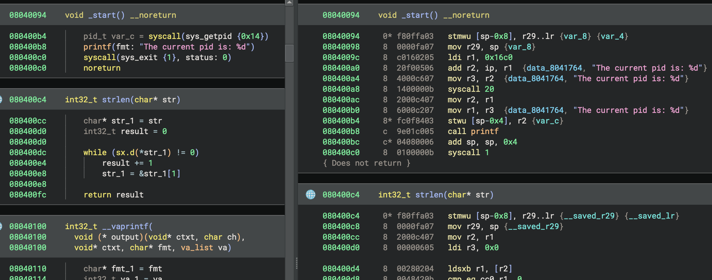
*One-shot analysis can make simple binaries look like source code with no user input*


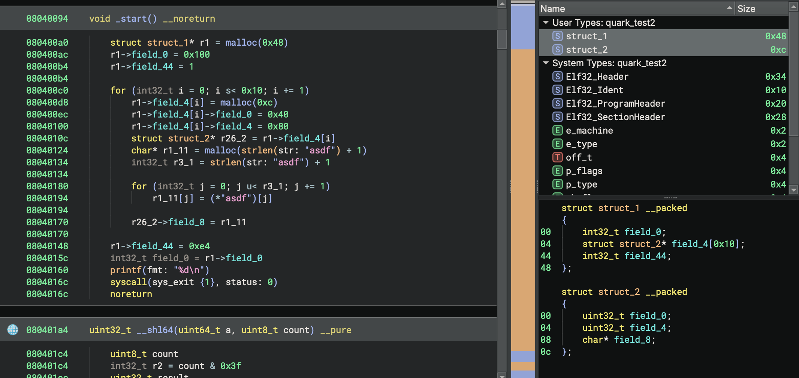
*User annotations allow for complex structure access recovery and analysis*


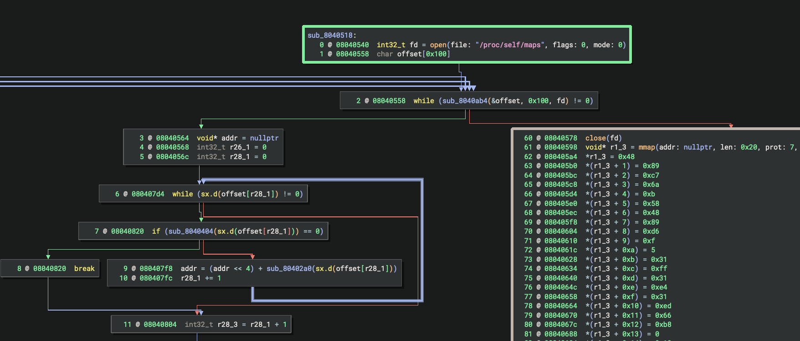
*Control flow recovery and calling convention support show how a payload parses its own memory map*


## Conclusion

We hope this guide helps you write custom architectures of your own and use some of the more advanced parts of Binary Ninja to improve your analysis. Enabling you to get professional-grade decompilation for obscure architectures has been one of our primary goals, since we can't possibly have official support for every architecture. It may not be trivial, but there are a bunch of resources online to help you along the way. If you want to read more, you can check out [our previous guide](https://binary.ninja/2020/01/08/guide-to-architecture-plugins-part1.html) [about Z80](https://binary.ninja/2021/12/09/guide-to-architecture-plugins-part2.html), our [open-source official plugins](https://github.com/Vector35/binaryninja-api/tree/dev/arch) [and examples](https://github.com/Vector35/binaryninja-api/blob/dev/python/examples/nes.py), and [some](https://github.com/samrussell/binja-gameboy) [of](https://github.com/galenbwill/binaryninja-m68k) [our](https://github.com/Accenture/NEC850_Architecture) [community](https://github.com/nicabi/binja-xtensa2) [plugins](https://github.com/otter-sec/bn-ebpf-solana). The source code for this guide is available [on our GitHub](https://github.com/Vector35/arch_quark) as well.

We look forward to hearing about all the obscure architectures you plan on lifting, so please feel free to [contact us](https://binary.ninja/support/) if you have any questions about the process. Until then, happy hacking! :)
